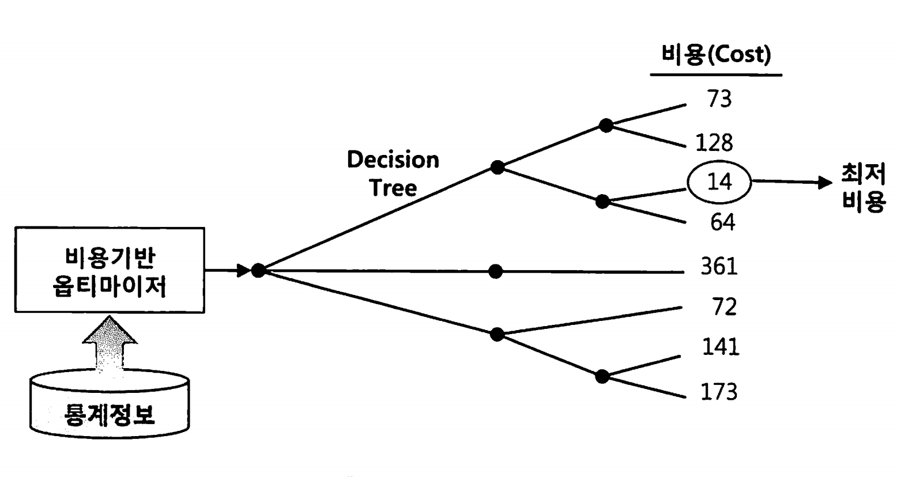
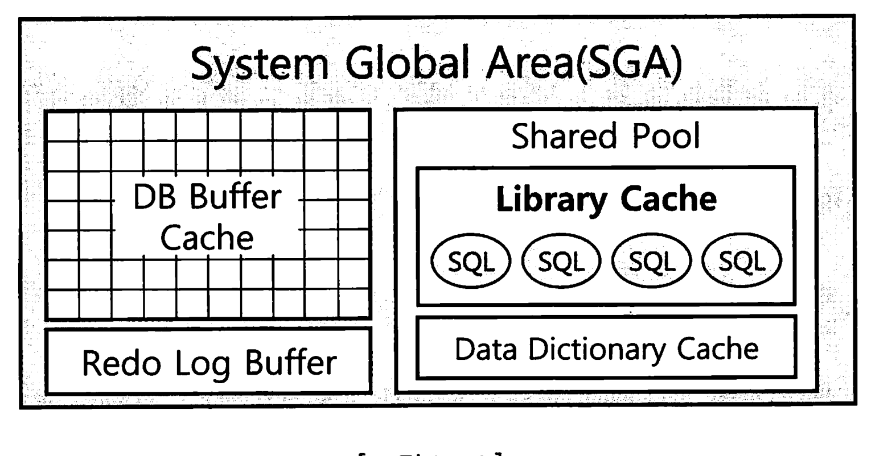
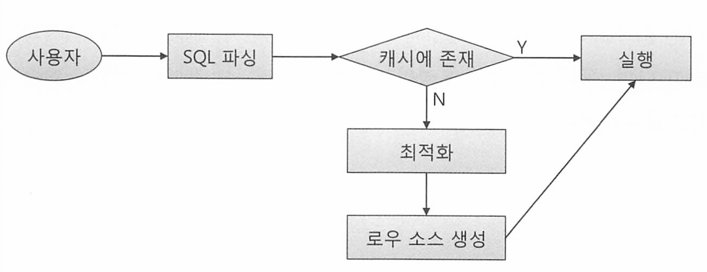

# 1장. SQL 처리 과정과 I/O

## 1.1 SQL 파싱과 최적화

### 1.1.1 구조적, 집합적, 선언적 질의 언어

SQL 은 구조적 질의 언어다. structured이고, set-based이며 declarative인 질의 언어다/.

* 집합(set-based)적이란건, 개별 행을 하나씩 처리하는게 아닌 데이터 집한을 한번에 처리한다는 의미 
* 선언적이라는것은, 어떻게 조회할지는 DBMS 처리에 맡기고, 무엇을 조회할지만 명확히 선언하여 기술한다는 의미

### 1.1.2 SQL 최적화

DBMS 내부에서 프로시저를 작성하고, 컴파일해서 실행 가능한 상태로 만드는 전 과정을 SQL 최적화 라고 한다.

SQL 실행 전 최적화 과정을 세분화하면 아래와 같다. 

1. SQL 파싱: SQL을 전달받으면 먼저 SQL 파서가 파싱을 진행한다
   * 파싱 트리 생성 : SQL문의 개별 구성 요소를 분석해서 파싱 트리 생성
   * Syntax 체크 : 문법적 오류가 없는지 확인. 키워드나 순서 확인 
   * Semantic 체크 : 의미상 오류가 없는지 확인. 존재하지않는 테이블이나 컬럼 및 해당 오브젝트에 대한 권한 확인
2. SQL 최적화 : 옵티마이저가 통계정보를 바탕으로 가장 효율적인 실행 경로를 선택한다. 
3. 로우 소스 생성 : 옵티마이저가 선택한 실행 경로를 실행 가능한 코드 또는 프로시저 형태로 포맷팅 하는 단계

### 1.1.3 SQL 옵티마이저

옵티마이저는 가장 효율적으로 작업을 수행할 수 있는 최적의 데이터 액세스 경로를 선택해주는 핵심 엔진이다.

옵티마이저의 최적화 단계를 요약하면 아래와 같다. 

1. 사용자로부터 전달받은 쿼리를 수행하는데 후보군이 될만한 실행계획들을 찾아낸다
2. 데이터 딕셔너리에 미리 수집해 둔 오브젝트 통계 및 시스템 통계 정보를 이용해 각 실행계획의 예상비용을 산정한다
3. 최저비용을 나타내는 실행계획을 선택한다.



### 1.1.4 실행계획과 비용

옵티마이저의 실행계획은 네비게이션과 비슷하다.

DBMS에도 SQL 실행경로 미리보기 기능이 있다. 그것이 실행 계획이다.

**MySQL**: `EXPLAIN`

```mysql
EXPLAIN SELECT * FROM employees WHERE department = 'IT';
```

**Oracle**: `EXPLAIN PLAN FOR`와 `DBMS_XPLAN`

```oracle
EXPLAIN PLAN FOR SELECT * FROM employees WHERE department = 'IT';
SELECT * FROM TABLE(DBMS_XPLAN.DISPLAY);
```

**PostgreSQL**: `EXPLAIN` 또는 `EXPLAIN ANALYZE`

```postgresql
EXPLAIN ANALYZE SELECT * FROM employees WHERE department = 'IT';
```

**DBMS별 각 테이블의 통계정보 수집방법.**

- **MySQL**: `ANALYZE TABLE`

  ```sql
  ANALYZE TABLE employees;
  ```

- **Oracle**: `DBMS_STATS.GATHER_TABLE_STATS`

  ```sql
  BEGIN
     DBMS_STATS.GATHER_TABLE_STATS('schema_name', 'employees');
  END;
  /
  ```

- **PostgreSQL**: `ANALYZE`

  ```sql
  ANALYZE employees;
  ```

Cost(비용)은 쿼리를 수행하는동안 발생할것으로 예상하는 I/O 횟수 또는 예상 소요시간 값인데, 이것이 가장 적은것을 수행하는것이 좋다.

### 1.1.5 옵티마이저 힌트

항상 옵티마이저가 선택한 실행계획이 최적인것은 아니다.

SQL이 복잡할수록 실수한 가능성도 크다. 

이럴때 옵티마이저 힌트를 이용해 데이터 액세스 경로를 지정할 수 있따. 

SQL 힌트는 쿼리의 실행 계획을 최적화하거나 특정 방식으로 강제하기 위해 사용됩니다. 각 DBMS별로 힌트를 적용하는 방법을 설명하겠습니다.

* MySQL에서는 힌트를 쿼리의 `SELECT` 문 뒤에 주석 형태로 작성

```sql
SELECT /*+ INDEX(employees idx_department) */ * 
FROM employees 
WHERE department = 'IT';
```

* Oracle에서는 힌트를 쿼리의 `SELECT` 문 뒤에 `/*+ */` 형식으로 작성

```sql
SELECT /*+ FULL(employees) */ * 
FROM employees 
WHERE department = 'IT';
```


PostgreSQL은 MySQL이나 Oracle과 달리 힌트 기능을 기본적으로 지원하지 않아서 

`pg_hint_plan` extension을 설치한 후, 힌트를 사용할 수 있다.

```sql
SELECT /*+ SeqScan(employees) */ * 
FROM employees 
WHERE department = 'IT';
```

자주 수행하는 힌트 목록

### MySQL 자주 사용하는 힌트 목록

| 힌트                 | 설명                                             | 예제                                                       |
| -------------------- | ------------------------------------------------ | ---------------------------------------------------------- |
| **최적화 목표**      |                                                  |                                                            |
| `MAX_EXECUTION_TIME` | 쿼리의 최대 실행 시간을 설정 (밀리초 단위)       | `SELECT /*+ MAX_EXECUTION_TIME(1000) */ * FROM employees;` |
| **액세스 방식**      |                                                  |                                                            |
| `USE INDEX`          | 특정 인덱스를 사용하도록 강제                    | `SELECT /*+ USE INDEX(idx_name) */ * FROM table_name;`     |
| `FORCE INDEX`        | 지정한 인덱스를 반드시 사용                      | `SELECT /*+ FORCE INDEX(idx_name) */ * FROM table_name;`   |
| `IGNORE INDEX`       | 지정한 인덱스를 사용하지 않도록 강제             | `SELECT /*+ IGNORE INDEX(idx_name) */ * FROM table_name;`  |
| **조인 순서**        |                                                  |                                                            |
| `STRAIGHT_JOIN`      | 조인의 순서를 최적화가 아닌 명시된 순서대로 처리 | `SELECT /*+ STRAIGHT_JOIN */ * FROM table1 JOIN table2;`   |
| **병렬 처리**        |                                                  |                                                            |
| `SQL_NO_CACHE`       | 쿼리 결과를 쿼리 캐시에 저장하지 않음            | `SELECT /*+ SQL_NO_CACHE */ * FROM table_name;`            |

### Oracle 자주 사용하는 힌트 목록

| 힌트                      | 설명                                                    | 예제                                                         |
| ------------------------- | ------------------------------------------------------- | ------------------------------------------------------------ |
| **최적화 목표**           |                                                         |                                                              |
| `ALL_ROWS`                | 최적의 처리량을 위해 전체 쿼리 비용을 최소화            | `SELECT /*+ ALL_ROWS */ * FROM employees;`                   |
| `FIRST_ROWS(n)`           | 응답 시간을 최소화하기 위해 처음 n개의 행 반환을 최적화 | `SELECT /*+ FIRST_ROWS(10) */ * FROM employees;`             |
| **액세스 방식**           |                                                         |                                                              |
| `INDEX`                   | 특정 인덱스를 사용하도록 강제                           | `SELECT /*+ INDEX(employees emp_idx) */ * FROM employees;`   |
| `FULL`                    | 테이블 풀 스캔을 사용하도록 강제                        | `SELECT /*+ FULL(employees) */ * FROM employees;`            |
| **조인 순서**             |                                                         |                                                              |
| `ORDERED`                 | 테이블을 FROM 절에 나열된 순서대로 조인                 | `SELECT /*+ ORDERED */ * FROM employees e, departments d WHERE e.dept_id = d.id;` |
| **조인 방식**             |                                                         |                                                              |
| `USE_NL`                  | NL 조인 사용을 강제                                     | `SELECT /*+ USE_NL(employees) */ * FROM employees e JOIN departments d ON e.dept_id = d.id;` |
| `USE_HASH`                | 해시 조인 사용을 강제                                   | `SELECT /*+ USE_HASH(employees) */ * FROM employees e JOIN departments d ON e.dept_id = d.id;` |
| `USE_MERGE`               | 소트 머지 조인 사용을 강제                              | `SELECT /*+ USE_MERGE(employees) */ * FROM employees e JOIN departments d ON e.dept_id = d.id;` |
| **서브쿼리 팩토링**       |                                                         |                                                              |
| `WITH_PLSQL`              | 서브쿼리를 PLSQL 블록으로 변환                          | `WITH /*+ WITH_PLSQL */ emp_cte AS (SELECT * FROM employees) SELECT * FROM emp_cte;` |
| **쿼리 변환**             |                                                         |                                                              |
| `NO_QUERY_TRANSFORMATION` | 쿼리 변환을 방지                                        | `SELECT /*+ NO_QUERY_TRANSFORMATION */ * FROM employees;`    |
| **병렬 처리**             |                                                         |                                                              |
| `PARALLEL`                | 쿼리를 병렬로 실행                                      | `SELECT /*+ PARALLEL(employees, 4) */ * FROM employees;`     |
| `NOPARALLEL`              | 병렬 실행을 하지 않도록 강제                            | `SELECT /*+ NOPARALLEL(employees) */ * FROM employees;`      |

### PostgreSQL (`pg_hint_plan` 확장) 자주 사용하는 힌트 목록

| 힌트                | 설명                                 | 예제                                                         |
| ------------------- | ------------------------------------ | ------------------------------------------------------------ |
| **최적화 목표**     |                                      |                                                              |
| `Leading`           | 조인의 순서를 제어하는 데 사용       | `SELECT /*+ Leading(t1 t2) */ * FROM t1 JOIN t2 ON t1.id = t2.id;` |
| **액세스 방식**     |                                      |                                                              |
| `SeqScan`           | 시퀀셜 스캔을 사용하도록 강제        | `SELECT /*+ SeqScan(employees) */ * FROM employees;`         |
| `IndexScan`         | 인덱스 스캔을 사용하도록 강제        | `SELECT /*+ IndexScan(employees emp_idx) */ * FROM employees;` |
| `BitmapScan`        | 비트맵 인덱스 스캔을 사용하도록 강제 | `SELECT /*+ BitmapScan(employees emp_idx) */ * FROM employees;` |
| `NoIndexScan`       | 인덱스 스캔을 사용하지 않도록 강제   | `SELECT /*+ NoIndexScan(employees) */ * FROM employees;`     |
| **조인 순서**       |                                      |                                                              |
| `NestLoop`          | NL 조인을 사용하도록 강제            | `SELECT /*+ NestLoop */ * FROM employees e JOIN departments d ON e.dept_id = d.id;` |
| `HashJoin`          | 해시 조인을 사용하도록 강제          | `SELECT /*+ HashJoin */ * FROM employees e JOIN departments d ON e.dept_id = d.id;` |
| `MergeJoin`         | 소트 머지 조인을 사용하도록 강제     | `SELECT /*+ MergeJoin */ * FROM employees e JOIN departments d ON e.dept_id = d.id;` |
| **서브쿼리 팩토링** |                                      |                                                              |
| `NoInline`          | CTE를 인라인화하지 않음              | `WITH emp_cte AS (SELECT * FROM employees) SELECT /*+ NoInline */ * FROM emp_cte;` |
| **쿼리 변환**       |                                      |                                                              |
| `NoPushDown`        | 서브쿼리를 푸시 다운하지 않음        | `SELECT /*+ NoPushDown */ * FROM employees WHERE dept_id IN (SELECT dept_id FROM departments);` |
| **병렬 처리**       |                                      |                                                              |
| `Parallel`          | 쿼리를 병렬로 실행                   | `SELECT /*+ Parallel(employees 4) */ * FROM employees;`      |
| `NoParallel`        | 병렬 실행을 하지 않도록 강제         | `SELECT /*+ NoParallel(employees) */ * FROM employees;`      |

## 1.2 SQL 공유 및 재사용

### 1.2.1 소프트 파싱 vs. 하드 파싱

SQL 파싱, 최적화, 로우소스 생성 과정을 거쳐 생성한 내부 프로시저를 반복 재사용할 수 있도록 캐싱해두는 메모리 공간을 라이브러리 캐시라고 한다.



Oracle의 라이브러리 캐시는 메모리 내에 SQL 문, PL/SQL 패키지 및 프로시저, 다양한 잠금 및 핸들을 저장하여 재사용한다. 

* MySQL 8.0부터는 쿼리 캐시 기능 삭제됌.
* Postgresql은 다음과 같은 캐시 메커니즘 사용
  * **계획 캐시**: 준비된 문과 함께 실행 계획을 캐시. 이는 동일한 쿼리가 여러 번 실행될 때 유용
  * **공유 버퍼**: 데이터 블록을 메모리에 캐시하여 디스크 I/O를 최소화합니다. PostgreSQL은 공유 버퍼를 통해 효율적인 캐시 관리



캐시에서 SQL을 찾아 곧바로 실행단계로 넘어가는 것을 soft parsing이라 하고,

찾는데 실패해 최적화 및 로우 소스 생성 단게까지 모두 거치는 것을 hard parsing 이라고 한다.

**SQL최적화 과정은 왜 하드한가?**

* 다섯개 테이블을 조인하는 쿼리문 하나를 최적화 하는데도 무수히 많은 경우의 수 존재. (5! = 120가지)
* 조인 알고리즘은 어떻게 쓸지, 인덱스는 어떤걸 쓸지 등.

때문에 옵티마이저는 순식간에 엄청난 연산을 통해 최적화 한다. 옵티마이저가 사용하는 정보는 다음과 같다.

* 테이블, 컬럼, 인덱스 정보
* 오브젝트 통계쩡보, 시스템 통계(cpu io block io)

때문에 매우 하드하다고 하며, 캐시가 필요한 이유이기도 하다 

* MySQL에서는 동시성 문제 및 병목 현상, 그리고 동적 데이터 쿼리 문제 때문에 쿼리 캐시를 없앴다고 한다.

### 1.2.2 바인드 변수의 중요성

바인드 변수(Bind Variable)는 SQL 문에서 값을 직접 입력하는 대신, 변수로 값을 전달하는 방법을 의미한다.

바인드 변수는 SQL 문이 실행될 때 값이 바인딩되며, 이를 통해 여러 가지 이점을 얻을 수 있다. 

* 성능 향상, 보안 강화, 그리고 코드 재사용성 증가

라이브러리 캐시에서 SQL을 찾기 위해 사용하는 키 값이 SQL 문 자체이므로 아래는 모두 다른 SQL이다

```sql
SELECT * FROM emp WHERE empno = 7900;
select * from emp where empno = 7900;
select * from emp where empno = 1234;
```

즉 모두 캐싱되서 저장될 수 있단 이야기다.

empno를 변수로 받도록 프로시저 하나를 공유하게 되면, 캐시도 훨씬 적게 사용하므로 부하가 줄어든게 된다.