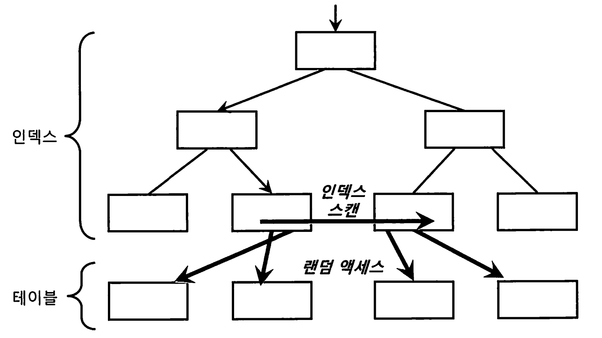
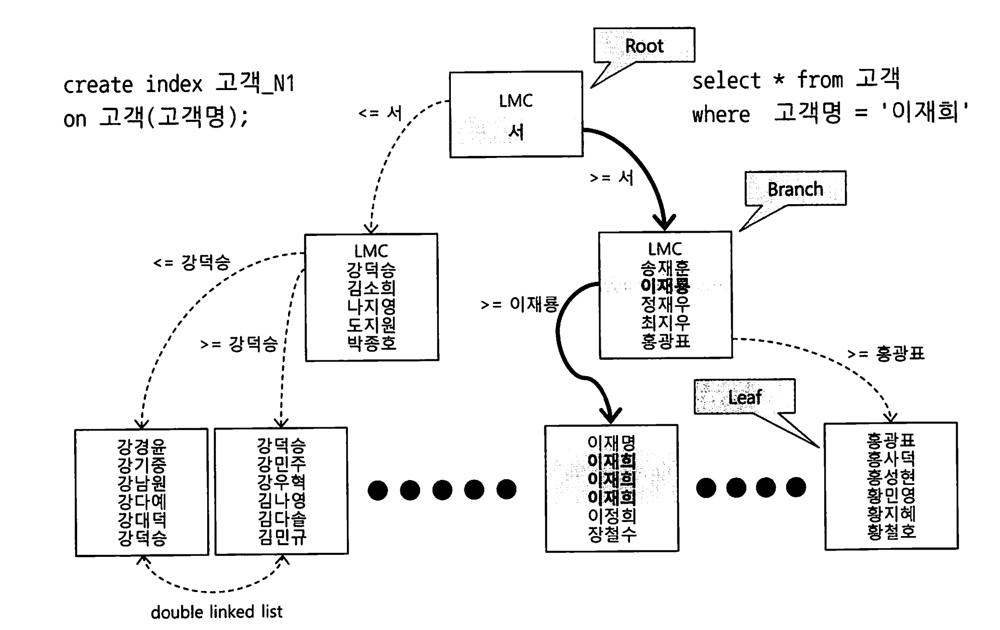
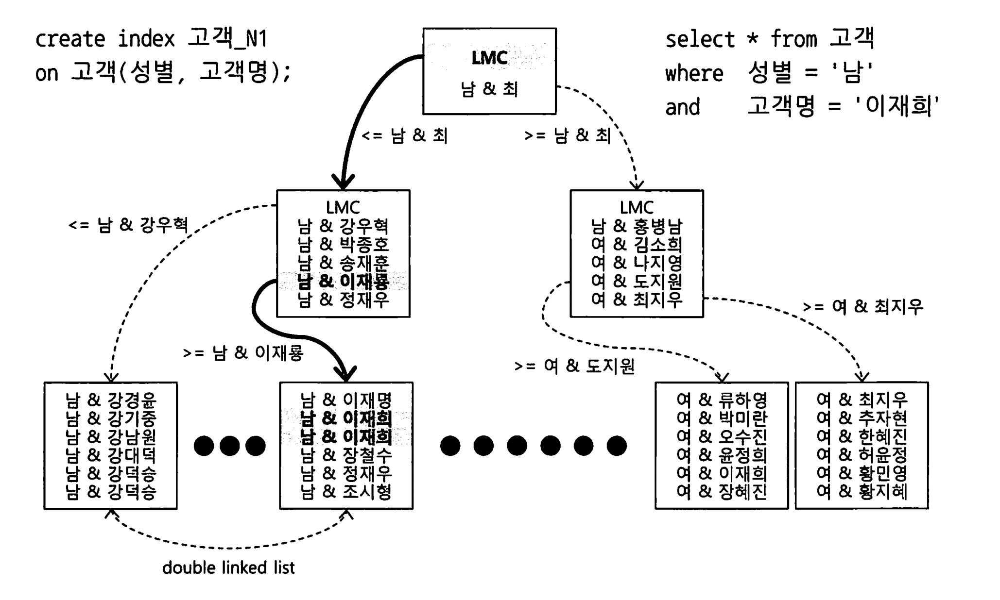
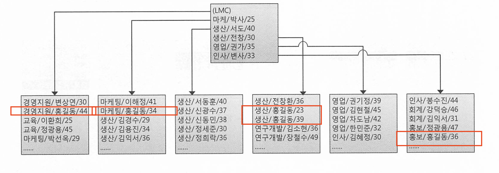
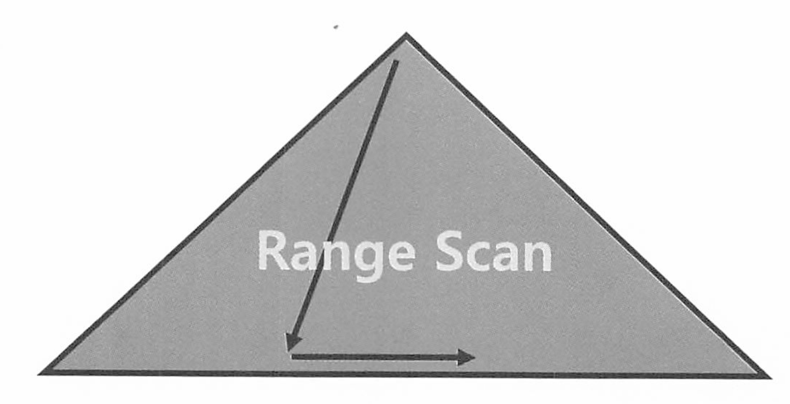
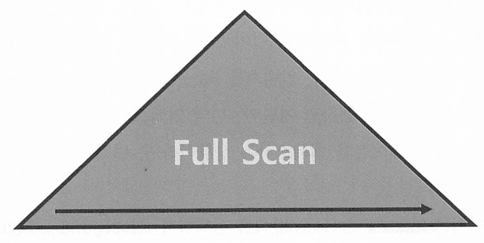
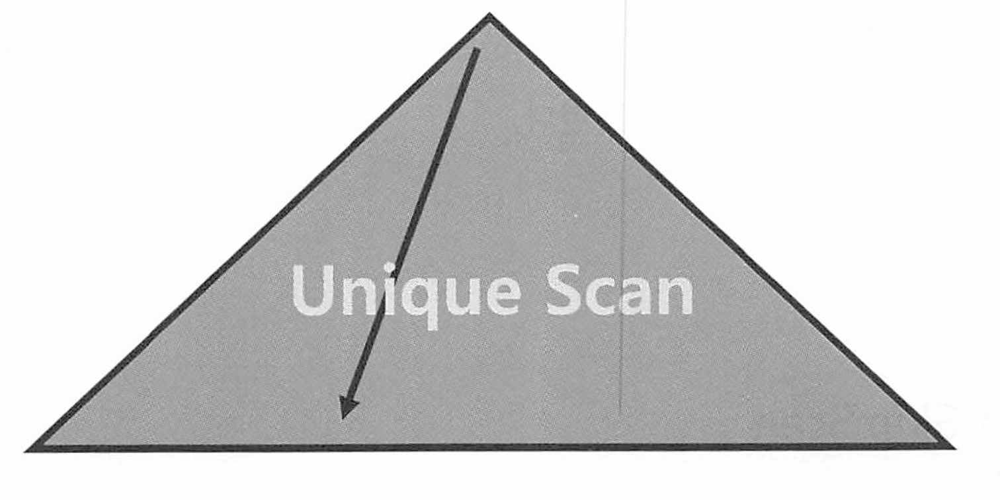
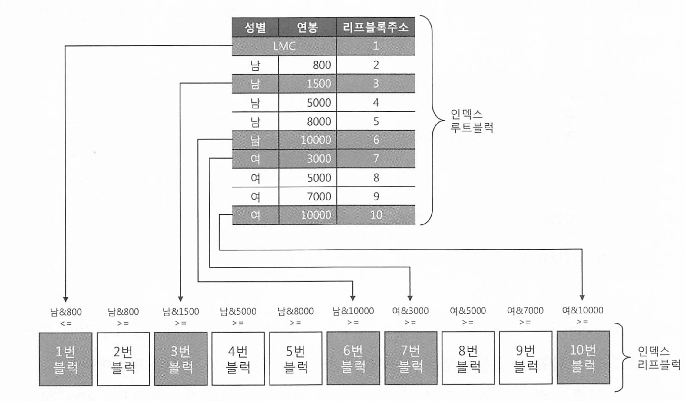

# 2장. 인덱스 기본

## 2.1 인덱스 구조 및 탐색

인덱스 탐색 과정은 수직, 수평 두단계로 이루어 진다. 

### 2.1.1 미리 보는 인덱스 튜닝

데이터를 찾는 방법은 크게 2가지다

* 인덱스 이용
* 풀 테이블 스캔

OLTP 시스템에서는 소량 데이터를 주로 검색하므로 인덱스 튜닝이 무엇보다 중요하다.

인덱스 튜닝의 핵심요소는 두가지로 나뉜다

* 인덱스 스캔과정의 비효율 줄이기
* 테이블 액세스 횟수 줄이기. -> 랜덤 액세스 최소화 튜닝

이 둘중 랜덤 액세스 최소화 튜닝이 성향에 미치는 영향이 더 크다. 

* 랜덤 액세스는 디스크 헤드 이동으로 인한 높은 비용이 발생하기 때문 시퀀셜 액세스 보다 훨 비효율적이다. 
* 비트리같은경우 리프노드까지 내려가는데 여러번의 랜덤 I/O가 발생하지만 클러스터링 인덱스가 더 좋은 이유는 순차적으로 접근하기 떄문 



인덱스에서 바로 반환하면 되는데 테이블에 랜덤 액세스를 하게되는것이 매우 비용이 크다 

### 2.1.2 인덱스 구조

인덱스는 대용량 테이블에서 필요한 데이터만 빠르게 효율적으로 액세스하기 위해 사용하는 객체다.

DBMS는 일반적으로 B Tree 인덱스를 사용한다.

Root, Branch, Leaf가 있다. 



루트와 브랜치 블록에 있는 각 레코드는 하위 블록에 대한 주소값을 갖는다. 

키값은 하위 블록에 저장된 키 값의 범위를 나타낸다. 

또한 루트와 브랜치블록에는 키 값을 갖지 않는 특별한 레코드가 있다.

이를 LMC, LeftmostChild라고 한다. 자식 노드 중 가장 왼쪽 끝에 위치한 블록이다.

* B-트리(B-tree)나 B+트리(B+tree)와 같은 트리 기반 인덱스 구조에서 사용되는 중요한 개념. 

* 범위 검색의 시작 지점은 일반적으로 LMC에서 시작한다. 탐색을 왼쪽에서 오른쪽으로 진행하여 전체 범위를 커버하기 위함이다.
* 삭제 삽입 후 트리 균형 위해 리밸런싱 수행시, LMC를 참조하여 트리를 적절히 조정한다. 또한 노드가 분할될때도 LMC를 재설정하여 트리 구조를 유지한다. 

리프블록에 저장된 각 레코드는 키 값순으로 정렬되있을뿐만 아니라, 테이블 레코드를 가리키는 주소값인 ROWID를 갖는다.

* 인덱스 키 값이 같으면 ROWID 순으로 정렬됌

인덱스를 스캔하는 이유는 ROWID를 얻기 위해서다.

ROWID는 아래와 같이 데이터 블록 주소(DBA, Data Block Address)와 로우 번 호로 구성되므로 이 값을 알면 테이블 레코드를 찾아갈 수 있다.

- ROWID = 데이터 블록 주소 + 로우 번호
- 데이터 블록 주소 = 데이터 파일 번호 + 블록 번호
- 블록 번호 : 데이터파일 내에서 부여한 상대적 순번
- 로우 번호 : 블록 내 순번

인덱스 탐색 과정은 수직적 탐색과 수평적 탐색으로 나눌 수 있다.

- 수직적 탐색 : 인덱스 스캔 시작지점을 찾는 과정
- 수평적 탐색 : 데이터를 찾는 과정

### 2.1.3 인덱스 수직적 탐색

인덱스 스캔 시작지점을 찾는 과정이다. -> 조건을 만족하는 첫번째 레코드를 찾는 과정 

수직 탐색은 루트 블록에서부터 시작해서 브랜치블록에 저장된 각 인덱스 레코드는 하위 블록에 대한 주소값을 찾는다. 

수직 탐색 과정에서 찾고자 하는 값이 크거나 같은 값을 만나면, 바로 직전 레코드가 가리키는 하위 블록으로 이동한다. 

### 2.1.4 인덱스 수평적 탐색

수직 탐색을 통해 스캔 시작점을 찾았으면, 찾고자 하는 데이터가 더 안나탈 때까지 인덱스 리프 블록을 수평적으로 스캔한다.

인덱스에서 본격적으로 데이터를 찾는 과정이다.

* 더 안나타날때까지란 뜻은, 나타나면 계속 찾는다는 말이다. 즉 같은 값이 여러개가 있으면.. 계속 찾게된다. 30% 미만 가져야 하는 이유다.

리프블록은 서로 앞뒤 블록에 대한 주소값을 가지는 더블 링크드 리스트 구조여서 우 좌 모두 수평 탐색이 가능하다.

인덱스를 수평적으로 탐색하는 이유는

1. 조건절을 만족하는 모든 데이터를 찾기 위해
2. ROW ID를 얻기 위해

필요한 컬럼을 인덱스가 모두 갖고있으면 바로 인덱스만 스캔하고 리턴하지만, 데이터가 더 있다면 테이블에 액세스 해야하므로 ROW ID가 필요하다. 

### 2.1.5 결합 인덱스 구조와 탐색

두 개 이상 컬럼으로 결합(복합)인덱스를 만들면 어떻게될까?



수직 탐색을 거쳐 인덱스 스캔 시작점이 성별 = '남'이 아니고, 성별 = '남' 이면서 고객명 '이재희'가 첫번째 레코드가 된다. 

인덱스 순서를 바꾸더라도, 인덱스 선두 컬럼을 모두 = 조건으로 검색할때는 어느 컬럼을 앞에 두든 블록 I/O 개수가 같으므로 성능도 똑같다. 

## 2.2 인덱스 기본 사용법

### 2.2.1 인덱스를 사용한다는 것

인덱스를 사용한다는것은, 시작점을 찾을 수 있다는것이다.

시작점을 찾을 수 없다는것은 어디서부터 어떻게 찾아야 할지 모른다는것이다. 

인덱스 컬럼을 가공(변형, 함수 등)해도 인덱스를 사용할 수는 있지만 스캔 시작점을 찾을 수 없고 멈출수도 없어 리프 블록 전체를 스캔해야 되서 인덱스 풀 스캔이 동작하게 된다.


인덱스를 정상적으로 사용한다는 표현은, 리프블록에서 스캔 시작점을 찾아 스캔하다가 중간에 멈추는 것을 의미한다.

-> 이것이 index range scan이다. 


### 2.2.2 인덱스를 Range Scan 할 수 없는 이유

인덱스 스캔 시작점을 찾을 수 없기 때문이다. 

일정 범위 스캔을 시작하려면 시작 지점과 끝지점을 알아야 한다. 만약 시작지점과 끝 지점을 찾지 못하면 전체를 스캔해야 하므로 이때는 인덱스 range scan을 할 수 없다는 의미이다. 

LIKE 검색도 마찬가지다. 대한 으로 시작하는 워딩은 특정 구간에 모여있어 Range Scan이 가능하지만, 대한을 포함하는 값은 전체 구간에 거쳐 흩어져 있으므로 시작범위 ,끝범위를 알 수 없기 때문에 Range 스캔이 불가능하다.

OR 조건도 마찬가지다. 특정 시적 지잠을 찾을수가 없다.

```
WHERE (전화번호 = :tel_no OR 고객명 = :customer_name)
```

다만 아래처럼 OR를 변환시키면 가능하긴 하다

```
SELECT * FROM 고객 WHERE 고객명 = :customer_name
UNION ALL
SELECT * FROM 고객 WHERE 전화번호 = :tel_no AND (고객명 != :customer_NO)
```

즉 아래처럼 힌트를 유도해서 쓸수있따

```
SELECT /*+ use_concat */ * FROM 고객
WHERE (전화번호 = :tel_no OR 고객명 = :customer_name)
```

IN 조건절에 대해서는 옵티마이저가 IN-List Iterator 방식을 사용한다. IN-LIST 개수만큼 인덱스 레인지 스캔을 반복하는것이다

* `IN` 절에서 지정된 값들이 인덱스에 존재하는 경우, 데이터베이스는 해당 인덱스를 사용하여 각 값을 개별적으로 검색하는것을 반복하는것이다. 

#### MySQL

MySQL에서 `IN` 절은 인덱스를 사용할 수 있다. MySQL은 `IN` 절을 여러 개의 `=` 조건으로 변환하여 인덱스를 활용한다

PostgreSQL에서도 마찬가지이다. 

### 인덱스를 정상적으로 사용할 수 없는 조건절들

1. **함수 또는 표현식을 포함한 조건절**
   - **예시**: `WHERE UPPER(name) = 'ALICE'`
   - 인덱스는 컬럼의 원래 값에 기반하여 정렬되므로, 함수나 표현식을 적용한 값에 대해 인덱스를 사용할 수 없습니
2. **범위를 포함한 조건절에서 부정형 연산자 사용**
   - **예시**: `WHERE age != 30` 또는 `WHERE age <> 30`
   - 부정형 연산자는 모든 다른 값을 검색해야 하므로, 인덱스 사용이 비효율적.
3. **비교 연산자와 함께 사용된 NULL 값 조건**
   - **예시**: `WHERE age IS NOT NULL`
   - 인덱스는 NULL 값을 포함하지 않으므로, `IS NOT NULL` 조건에서는 인덱스를 사용할 수 없다.
4. **부정적인 패턴 매칭 연산자**
   - **예시**: `WHERE name NOT LIKE 'A%'`
   - 부정형 패턴 매칭은 인덱스를 효과적으로 사용할 수 없다.
5. **범위를 포함한 조건절에서 비효율적인 패턴 매칭 연산자**
   - **예시**: `WHERE name LIKE '%Alice%'`
   - 와일드카드 `%`가 앞에 오면 인덱스를 사용할 수 없다. 이는 인덱스가 앞부분부터 정렬되어 있기 때문에 패턴의 앞부분이 고정되지 않으면 검색이 비효율적이다.
6. **OR 조건절**
   - **예시**: `WHERE age = 25 OR name = 'Alice'`
   - 인덱스를 사용할 수 없는 경우가 많으며, 풀 테이블 스캔이 발생할 가능성이 높다. 다만, 각 조건이 인덱스를 사용할 수 있는 경우는 예외.
7. **다중 컬럼 인덱스에서 조건이 인덱스 순서와 맞지 않는 경우**
   - **예시**: 인덱스가 `(name, age)`일 때 `WHERE age = 30`만 사용
   - 인덱스는 첫 번째 컬럼에 대한 조건이 있을 때만 효율적으로 사용.
8. **LIKE 연산자에서 패턴이 와일드카드로 시작할 때**
   - **예시**: `WHERE name LIKE '%bob%'`
   - 앞에 와일드카드가 있으면 인덱스를 사용할 수 없다.
9. **비교 연산자와 비일치하는 데이터 타입**
   - **예시**: `WHERE varchar_column = 123`
   - 인덱스가 효과적으로 사용되지 않는다.

### 2.2.3 더 중요한 인덱스 사용 조건



인덱스를 그림처럼 소속팀 + 사원명 + 연령 순으로 구성했다.

* 데이터를 소속팀 순으로 정렬하고, 소속팀이 같으면 사원명으로 정렬하고, 사원명이 같으면 연령순으로 정렬한다. 

```
SELECT * FROM 사원 WHERE 사원명 = '홍길동'
```

위 쿼리에 대해 정상적으로 RANGE SCAN 할 수 없다.


위 쿼리는 사원명을 검색한다.

이름이 같은 사원이더라도, 소속팀이 다르면 서로 멀리 떨어지게 되므로 효과적으로 스캔할 수 없다.

스캔 시작점을 찾을수도, 어디서 멈춰야 할 수도 없기 때문에 인덱스 풀 스캔을 해야한다.

**인덱스를 Range Scan 하기 위한 가장 첫 번째 조건은 인덱스 선두 컬럼이 조건절에 있어야 한다는 사실이다. 가공하지 않은 상태로 말이다**

* 복합 인덱스 사용시 선두 컬럼이 가공되지 않은상태로 조건절에 있으면 인덱스 Range Scan은 무조건 가능하다. 나머지는 가공해도 된다.

### 인덱스를 잘 사용하니까 튜닝 끝?

인덱스를 사용한다는것은 range scan이란 뜻이다.

인덱스를 정말 잘 사용하는지는 **스캔하는 양** 을 잘 따져봐야 한다 

인덱스를 사용하는데 데이터를 100만건이나 조회하면 인덱스를 잘 사용하는것이 맞을까? 

### 2.2.4 인덱스를 이용한 소트 연산 생략

인덱스를 Range Scan할 수 있는 이유는 데이터가 정렬돼 있기 때문이다.

찾고자 하는 데이터를 일정 부분만 읽다가 멈출 수 있다.

정렬되어 있기 때문에 sort 연산도 생략이 가능하다. 


PK를 장비번호 + 변경일자 + 변경순번으로 구성한 상태변경이력 테이블이 있다고 가정한다.

아래 쿼리처럼 이퀄 조건을 검색하면 PK 인덱스를 사용하므로 결과집합은 변경순번 순으로 출력된다

```sql
SELECT *
FROM 상태변경이력
WHERE 장비번호 = 'C'
AND 변경일자 = '20180316'
ORDER BY 변경순번
```

PK인덱스를 스캔하면서 출력한 결과는 어차피 변경순번대로 정렬되기 때문에 ORDER BY가 있어도 정렬 연산을 따로 수행하지 않는다. 


내림차순(Desc)에도 인덱스를 활용한다.

리프 블록은 양방향 연결리스트 이기 때문에, DESC 조건이 있다면 ASC랑 반대로 우측에서부터 좌측으로 수평 탐색을 한다. 

### 2.2.5 ORDER BY 절에서 컬럼 가공

ORDER BY 절에서도 컬럼을 가공하면 인덱스를 제대로 사용할 수 없다.

```sql
SELECT *
FROM 상태변경이력
WHERE 장비번호 = 'C'
AND 변경일자 = '20180316'
ORDER BY 변경일자 || 변경순번
```

예시 : PK는 주문일자 + 주문번호다

```sql
SELECT *
FROM (
    SELECT 
        TO_CHAR(A.주문번호, 'FW000000') AS 주문번호, 
        A.업체번호, 
        A.주문금액
    FROM 주문 A
    WHERE A.주문일자 = :dt
    AND A.주문번호 > NVL(:next_ord_no, 0)
    ORDER BY 주문번호
)
WHERE ROWNUM <= 30;
```

* 위 쿼리 ORDER BY 절은 실행계획에 SORT ORDER BY 를 사용. 왜냐하면 SELECT 절 내의 가공된 주문번호로 정렬하기 때문.
* 아래처럼 사용해야 인덱스를 사용해서 정렬 게획을 하지 않게된다

```sql
SELECT *
FROM (
    SELECT 
        TO_CHAR(A.주문번호, 'FW000000') AS 주문번호, 
        A.업체번호, 
        A.주문금액
    FROM 주문 A
    WHERE A.주문일자 = :dt
    AND A.주문번호 > NVL(:next_ord_no, 0)
    ORDER BY A.주문번호
)
WHERE ROWNUM <= 30;
```


### 2.2.7 자동 형변환

컬럼과 조건절의 타입(형)도 같아야 한다. 문자형을 숫자형으로 비교해도 인덱스를 사용하지 못할수도 있다.

Oracle에서는 숫자형과 문자형 조건절이 혼합되면, 문자형 데이터를 숫자형 데이터로 암묵적으로 변환한다.

```sql
SELECT * FROM orders WHERE order_id = '123';
```

MySQL에서는 조건절에서 숫자형과 문자형이 혼합되면, 일반적으로 문자형 데이터를 숫자형 데이터로 변환하려고 시도한다.

postgredsql은 암묵적인 타입 변환을 허용하지 않으며, 명시적인 타입 변환이 필요하다. 

LIKE는 또 다르다.

LIKE 자체가 문자열 비교이므로 Oracle은 문자형 기준으로 숫자형 컬럼이 변경된다. 

MySQL에서는 `LIKE` 연산자를 숫자형 컬럼에 사용하면 암묵적으로 숫자형을 문자형으로 변환한다.

PostgreSQL에서는 `LIKE` 연산자를 숫자형 컬럼에 사용할 수 없다.


**자동 형변환 성능**

LIKE 조건을 옵션 조건 처리 목적으로 사용하는 경우가 있다.

예를 들어 거래 데이터 조회시 계좌번호는 사용자가 입력할수도, 안할수도 있는 조건인데 이를 처리하려면 두개 SQL이 필요하다

```sql
-- 사용자가 계좌번호 입력시
SELECT * FROM 거래 WHERE 계좌번호 = :acnt_no
AND 거래일자 between :trd_dt1 and :trd_dt2

-- 사용자가 계좌번호 입력하지 않을 경우
SELECT * FROM 거래 WHERE 거래일자 between :trd_dt1 and :trd_dt2
```

많은 개발자가 이것을 1개 쿼리로 처리하려고 LIKE 조건을 사용한다.

```sql
SELECT * FROM 거래
WHERE 계좌번호 LIKE :acnt_no || '%'
AND 거래일자 between :trd_dt1 and :trd_dt2
```

* 사용자가 계좌번호 입력하지 않으면 :anct_no 변수에 null이 되어 모든 계좌번호가 조회됌 
* :acnt_no`가 `'123'이면, LIKE '123%', 만약 `:acnt_no`가 `NULL`이면, `LIKE '%'`와 동일해져서 모든 계좌번호가 조회

이 방식을 사용하면 LIKE 조건을 같이 사용해서 인덱스 스캔 효율이 안좋아진다. 

**또한 만약 계좌번호가 숫자라면 자동형변환이 LIKE에 대해 문자열로 되므로 인덱스 액세스 조건으로 사용되지 못한다.** 


SQL 성능 원리는 TO_CHAR, TO_DATE, TO_NUMBER같은 형변환 함수가 성능이 좋지 않을거라고 에상돼 
의도적으로 생략하곤 한다. 연산 횟수가 줄고 인덱스를 올바르게 사용할것이라고 말이다.

그러나 SQL 성능은 블록 I/O를 줄이는 곳에서 좋아진다. 형변환 함수를 생략한다고 해서 연산 횟수가 주는것도 아니다. 

## 2.3 인덱스 확장기능 사용법

### 2.3.1 Index Range Scan



BTree 인덱스의 가장 일반적이고 정상적인 형태의 액세스 방식이다.

루트에서 리프까지 수직 탐색 후 탐색한 후에 필요한 범위(range)만 스캔한다.

인덱스 선두 컬럼을 가공하지 않은 상태로 조건절에 사용하면 index range scan은 무조건 가능하다.

성능은 인덱스 스캔 범위, 테이블 액세스 횟수를 얼마나 줄일 수 있느냐로 결정된다. 

```
--postgresql
                                                   QUERY PLAN
--------------------------------------------------------------------------------------------------------------
 Bitmap Heap Scan on orders  (cost=4.32..20.44 rows=10 width=48) (actual time=0.016..0.028 rows=5 loops=1)
   Recheck Cond: ((order_date >= '2023-01-01'::date) AND (order_date <= '2023-01-31'::date))
   Heap Blocks: exact=5
   ->  Bitmap Index Scan on orders_order_date_idx  (cost=0.00..4.32 rows=10 width=0) (actual time=0.010..0.010 rows=5 loops=1)
         Index Cond: ((order_date >= '2023-01-01'::date) AND (order_date <= '2023-01-31'::date))
 Planning Time: 0.123 ms
 Execution Time: 0.045 ms


-- oracle
--------------------------------------------------------------------------------
| Id  | Operation                   | Name         | Rows  | Bytes | Cost (%CPU)|
--------------------------------------------------------------------------------
|   0 | SELECT STATEMENT            |              |     5 |   455 |     3   (0)|
|   1 |  TABLE ACCESS BY INDEX ROWID| ORDERS       |     5 |   455 |     3   (0)|
|*  2 |   INDEX RANGE SCAN          | ORDERS_IDX   |     5 |       |     2   (0)|
--------------------------------------------------------------------------------

-- mysql 
id   select_type   table   type    possible_keys        key                  key_len   ref     rows    Extra
1    SIMPLE        orders  range   orders_order_date_idx orders_order_date_idx 3        NULL    5       Using where

```

### 2.3.2 Index Full Scan



수직 탐색 없이 리프 블록을 처음부터 끝까지 수평적으로 스캔하는 방식이다.

```
-- postgresql 
PostgreSQL에서는 인덱스 풀 스캔이라는 용어는 사용되지 않지만, 인덱스를 통해 모든 행을 스캔하는 방식은 다음과같다 
 
--------------------------------------------------------------------------------------------------------------
 Seq Scan on orders  (cost=0.00..20.44 rows=10 width=48) (actual time=0.016..0.028 rows=5 loops=1)
   Filter: (order_date IS NOT NULL)
   Rows Removed by Filter: 0
 Planning Time: 0.123 ms
 Execution Time: 0.045 ms

-- mysql
id   select_type   table   type    possible_keys        key                  key_len   ref     rows    Extra
1    SIMPLE        orders  index   NULL                 orders_order_date_idx 3        NULL    5       Using index

```


옵티마이저는 인덱스 사용 컬럼이 조건절에 없으면 

우선적으로 table full스캔을 고려하고, 테이블이 너무 크다면 인덱스 풀스캔을 고려한다.

데이터 저장공간은 컬럼 길이 x 레코드 수에 의해 결정되므로 인덱스가 차지하는 면적은 테이블보다 훨씬 적다

이럴때 인덱스 풀 스캔 방식을 선택한다. 


**인덱스 풀 스캔이 효율적일 때**

SALARY > 9000이라는 조건일시 (급여가 9천 이상인경우 )

* 전체 테이블중 일부라면 인덱스 풀 스캔을 통한 필터링이 효율적임 

**테이블 풀 스캔이 효율적일 때** 

SALARY > 1000 이라는 조건일시

* 전체 테이블 중 대다수라면 테이블 풀 스캔이 효율적임 

### 2.3.3 Index Unique Scan



수직적 탐색만으로 데이터를 찾는 스캔방식으로서, Unique 인덱스를 = 조건으로 탐색하는 경우에 작동한다.

데이터를 1건만 찾으면 되니까.


만약 UNIQUE 인덱스여도, 범위 조건 으로 검색하게 된다면 그때는 Index Range Scan으로 처리될 수 밖에 없다. 

또한 UNIQUE 결합(복합)인덱스에 대해 일부 컬럼만으로 검색할 때도 Index Range Scan이 나타난다.

* 주문상품 PK가 주문일자 + 고객ID + 상품ID인데 주문 일자와 고객 ID로만 검색하는 경우. 

### 2.3.4 Index Skip Scan

인덱스 스킵 스캔(Index Skip Scan)은 복합 인덱스(composite index)를 사용하는 최적화 기법으로, 인덱스의 선두 컬럼을 생략하고 후속 컬럼을 통해 효율적으로 검색할 수 있게하는 방식이다.

* 선두 컬럼의 Distinct Value(카디널리티가 낮고)이 적고 후행 컬럼의 Distinct Value(카디널리티가 높을)  갯수가 많을때 유용하다. 
* 예를들어 고객 테이블에서 성별이 카디널리티가 낮고 고객번호는 카디널리티가 높다. 


일반적인 인덱스 사용 방식과 달리 인덱스의 선두 컬럼에 대한 값이 없이도 인덱스를 사용할 수 있도록 도와준다.



위 그림은 인덱스 루트 블록과 리프블록이다. 성별 + 연봉으로 구성된 결합 인덱스다.

아래 조건식의 처리 방법을 보자 

```
SELECT * FROM 사원 WHERE 성별 = '남' and 연봉 between 2000 and 4000
```

* 성별 '남'이면서 연봉 2000인 첫 블록을 찾아야함. -> 3번블럭
* 이후 성별 '남' 이면서 연봉 4000 이하인 블럭을 만나면 멈추면 된다.  

 

index Skip Scan은 루트 또는 브랜치(중간) 블록에서 읽은 컬럼 값 정보를 토대로, 조건절에 부합하는 레코드를 포함할 가능성이 있는 리프 블록만 골라서 액세스 하는 스캔 방식이다. 

* 두번째 레코드가 가리키는 리프 블록은 남 & 800 이면서 남 & 1500 이하이므로 스킵
* 세번째 레코드는 1500 이상 5000 이하이므로 액세스
* 네번째 레코드는 5000 이상 8000 이하이므로 스킵.. 5번째 레코드도 마찬가지이다. 

그러나 7번 블럭은 다르다. (여 & 3000)

액세스 안해도 될거같지만 레코드에 액세스 해야한다.

* 여자 중에서 연봉 < 3000 이거나 (조건이 2천 이상이니까 ) 남과 여 사이 다른 성별이 존재한다면 이 블록에 저장되기도 하기 때문이다. 
* 8번 블럭, 9번 블록은 스킵해도 된다. 
* 그러나 마지막 블록은 액세스 해야한다. 여 보다 큰 다른 값이 있을 수 있으므로 액세스해서 파악해야 한다. 


실행계획 예시

mysql

```
mysql> EXPLAIN SELECT * FROM employees WHERE gender = 'M' AND hire_date > '1990-01-01'\G
*************************** 1. row ***************************
           id: 1
  select_type: SIMPLE
        table: employees
   partitions: NULL
         type: range
possible_keys: idx_gender_hiredate
          key: idx_gender_hiredate
      key_len: 4
          ref: NULL
         rows: 155191
     filtered: 100.00
        Extra: Using index condition; Using index skip scan
```

postgresql 

PostgreSQL은 버전 11부터 인덱스 스킵 스캔과 유사한 기능을 제공한다. PostgreSQL에서는 이를 "Index Only Scan"과 "Bitmap Index Scan" 등의 기능을 통해 유사한 최적화를 수행한다. 

Index Only Scan: 인덱스만으로 쿼리를 해결할 수 있을 때 사용

Bitmap Index Scan: 여러 인덱스를 결합하여 효율적으로 데이터를 검색

```
postgres=# EXPLAIN SELECT * FROM employees WHERE gender = 'M' AND hire_date > '1990-01-01';
                                  QUERY PLAN
-------------------------------------------------------------------------------
 Index Only Scan using idx_gender_hiredate on employees
   Index Cond: ((gender = 'M'::bpchar) AND (hire_date > '1990-01-01'::date))
(2 rows)

00000000-


postgres=# EXPLAIN SELECT * FROM employees WHERE gender = 'M' AND hire_date > '1990-01-01';
                                  QUERY PLAN
-------------------------------------------------------------------------------
 Bitmap Heap Scan on employees
   Recheck Cond: ((gender = 'M'::bpchar) AND (hire_date > '1990-01-01'::date))
   ->  Bitmap Index Scan on idx_gender_hiredate
         Index Cond: ((gender = 'M'::bpchar) AND (hire_date > '1990-01-01'::date))
(4 rows)
```


인덱스 선두 컬럼이 카디널리티가 낮고, 후행 컬럼이 카디널리티가 높을때 효과적이라고 했지만

선두 컬럼이 없을때만 인덱스 스킵 스캔이 작동하는것은 아니다

ex) PK = 업종유형코드 + 업종코드 + 기준일자

아래 SQL 처럼 선두 컬럼(업종유형코드)는 있고, 중간 컬럼(업종 코드)에 대한 조건이 없을때도 스킵 스캔이 사용 가능하다

```
SELECT 기준일자..
FROM 일별업종별거래 
WHERE 업종유형코드 = '01'
AND 기준일자 between a and b
```

또한 카디널리티가 낮은 두 개의 선두 컬럼이 모두 조건절에 없는 경우에도 사용할 수 있다. 


선두컬럼이 부등호, BETWEEN, LIKE 같은 범위조건 검색일때도 사용할 수 있다. 

* 원래는 성능이 원하는대로 안나올 수 있다. range scan이 너무 광범위하게 사용될 수 있기 때문이다. 

이처럼 index range scan이 불가능하거나 비효율적인 상황에서는 skip scan이 종종 빛을 발한다. 

### 2.3.5 Index Fast Full Scan

> postgresql, mysql에는 없는 개념이다.
>
> index only scan 이라는 기능이 그나마 유사한 기능이다.
>
> mysql 에서는 covering index scan이라는것과 비슷하다. 

인덱스의 모든 블록을 읽어서 원하는 데이터를 가져오는 방식이다 인덱스의 모든 엔트리를 읽지만, 테이블 액세스는 하지않는다. 

multiblock I/O 방식으로 스캔한다. 

인덱스 리프 노드가 갖는 연결 리스트 구조를 무시하고, 한번에 대량의 인덱스를 읽기 때문에 결과 집합이 인덱스 키 순서대로 정렬되지 않고, 쿼리에 사용한 컬럼이 모두 인덱스에 포함되어있을 때만 사용할 수 있다.

### 2.3.6 Index Range Scan Descending

index range scan은 좌측 리프노드부터 읽지만 index range scan descending은 뒤에서(우측)부터 왼쪽으로 스캔하기 때문에 내림차순으로 정렬된 결과집합을 얻는다는 점만 다르다.