# 3장. 인덱스 튜닝

SQL 튜닝은 랜덤I/O 액세스와의 전쟁이다.

모든 최적화가 랜덤 I/O를 얼마나 줄이느냐에 관건되어있다. 

## 3.1 테이블 액세스 최소화

### 3.1.1 테이블 랜덤 액세스

수천만 수억건이 있어도 인덱스를 사용하는 경우 빠른경우가 있꼬, 인덱스를 이용하니 풀 테이블 스캔보다 느릴때도 있다.


인덱스 ROWID는 물리적 주소? 논리적 주소?

아래는 인덱스를 이용해 테이블을 액세스하는 실행계획이다.

SQL이 참조하는 컬럼을 인덱스가 모두 포함하는 경우가 아니면 인덱스를 스캔한 후 반드시 테이블에 액세스 한다.

```sql
-- oracle
------------------------------------------------------------------------------------
| Id  | Operation                    | Name        | Rows  | Bytes | Cost (%CPU)|
------------------------------------------------------------------------------------
|   0 | SELECT STATEMENT             |             |    10 |   130 |     5   (0)|
|   1 |  TABLE ACCESS BY INDEX ROWID | MY_TABLE    |    10 |   130 |     5   (0)|
|*  2 |   INDEX RANGE SCAN           | MY_INDEX    |    10 |       |     3   (0)|
------------------------------------------------------------------------------------


-- mysql
+----+-------------+---------+------------+-------+---------------+---------+---------+-------+------+----------+-------------+
| id | select_type | table   | partitions | type  | possible_keys | key     | key_len | ref   | rows | filtered | Extra       |
+----+-------------+---------+------------+-------+---------------+---------+---------+-------+------+----------+-------------+
|  1 | SIMPLE      | my_table| NULL       | range | my_index      | my_index| 4       | const |   10 |   100.00 | Using where |
+----+-------------+---------+------------+-------+---------------+---------+---------+-------+------+----------+-------------+

-- postgresql
---------------------------------------------------------
 Index Scan using my_index on my_table  (cost=0.29..8.50 rows=1 width=10)
   Index Cond: (col1 = 'value'::text)
---------------------------------------------------------

```

인덱스를 스캔하는 이유는, 검색 조건을 만족하는 소량의 데이터를 인덱스에서 빨리 찾은 후, 거기서 테이블 레코드를 찾아가기 위한 주소값인 ROWID를 얻고 조회하려는 이유이다.

인덱스 ROWID는 논리적 주소에 가깝다. 물리적으로 직접연결되지 않고, 테이블 레코드를 찾아가기 위한 논리적 주소 정보를 담고있다. 

* 포인터가 아니다. 물리적으로 연결된 구조도 아니다. 찾아가기 위한 위치 정보를 담는다.
* ex) 7번 데이터 파일 123번 블록 10번째 레코드 -> Data Block Address라고도 한다

**즉 ROWID를 이용한 테이블 액세스가 생각만큼 빠르지가 않다.** 

> mysql에서는 유사한 개념으로 클러스터링 테이블, 클러스터링 인덱스가 사용된다
>
> postgresql에서는 ctid(튜플 아이덴티파이어)라는 시스템 컬럼을 사용한다. 
>
> - (블록 번호, 블록 내 튜플 인덱스) 형태 

### 3.1.2 인덱스 클러스터링 팩터

인덱스 클러스터링 팩터(cf)란 특정 컬럼을 기준으로 같은 값을 갖는 데이터가 서로 모여있는 정도를 의미한다. 

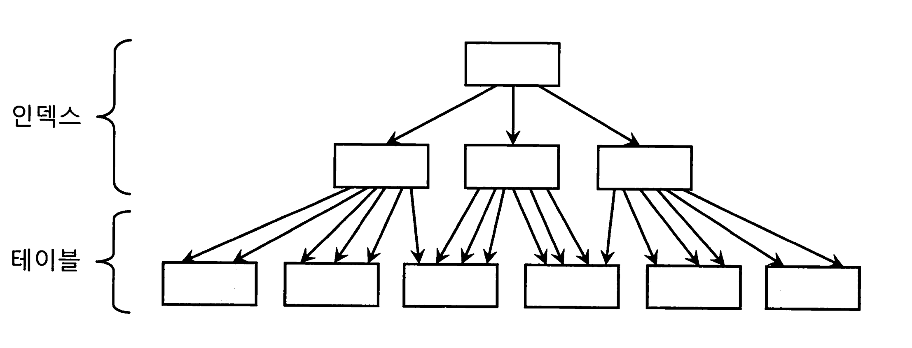

위 그림은, 인덱스 클러스터링 팩터가 가장 좋은 상태를 도식화 한 것으로써, 인덱스 레코드 정렬 순서와 테이블 레코드 정렬 순서가 100% 일치하는것을 볼 수 있다.

반면 아래는 인덱스 레코드 정렬 순서와 테이블 레코드 순서가 일치하지 않는 나쁜 상태이다.

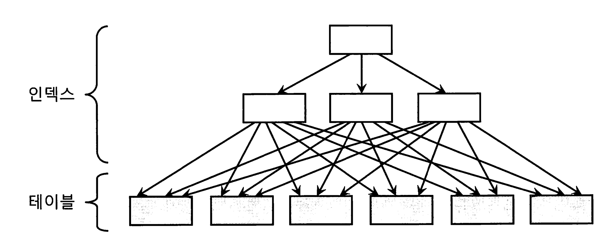

cf가 좋을수록 검색 효율이 좋다. 테이블 액세스량에 비해 블록 I/o가 적게 발생하기 때문이다. 

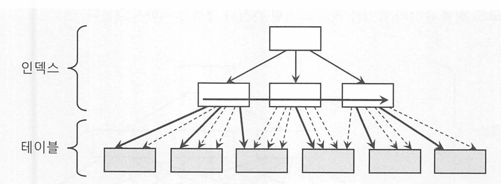

* 굵은 실선은 실제 블록 I/O 발생하는 경우, 가는 점선은 블록을 찾아가는 과정(논리적 블록 I/O) 없이 포인터로 바로 액세스 하는 경우

#### 클러스터링 팩터가 좋은 경우(낮은 경우):

- 인덱스의 순서와 테이블 데이터의 물리적 순서가 유사하다.
- 한 번의 인덱스 스캔으로 읽어들인 블록이 테이블에서 연속적으로 저장된 데이터를 참조한다. (블록단위로 데이터를 읽으니까.)
- 디스크 I/O가 최소화되며, 테이블 블록을 적게 읽게 된다.
- 이로인해 전체 성능이 향상된다 

#### 클러스터링 팩터가 나쁜 경우(높은 경우):

- 인덱스의 순서와 테이블 데이터의 물리적 순서가 일치하지 않는다.
- 인덱스 스캔 시 테이블의 여러 블록을 불연속적으로 읽어야 한다. (I/O가 발생)
- 디스크 I/O가 증가하며, 더 많은 테이블 블록을 읽어야 한다..
- 이로 인해 전체 성능이 저하된다.

클러스터링 팩터가 낮으면 인덱스 스캔 후 테이블 블록에 접근할 때 물리적으로 인접한 블록에 접근하게 되므로 디스크 I/O가 줄어들고 성능이 향상된다. 반대로 클러스터링 팩터가 높으면 여러 블록에 불연속적으로 접근해야 하므로 디스크 I/O가 증가하여 성능이 저하된다. (랜덤 I/O 액세스 )

* MySQL의 주요 스토리지 엔진인 InnoDB는 클러스터형 인덱스를 사용하여 기본 키에 따라 데이터를 물리적으로 정렬하여 저장하므로  기본 키를 기준으로 하는 쿼리에서 클러스터링 팩터가 낮아 성능이 향상된다.

* **Postgre의 경우 Primary Key에 대해 "Index"를 자동으로 생성하지만,**

  **이는 Cluster Index가 아니며 따라서 데이터의 정렬을 보장하지 않는다.**

  * cluster 명령어를 지원하긴 하지만, 일회성일뿐 이후 데이터들은 게속 주기적으로 재정렬되진 않는다 - https://www.postgresql.org/docs/14/sql-cluster.html

### 3.1.3 인덱스 손익분기점

인덱스 ROWID를 이용한 테이블 액세스는 생각보다 고비용이다. 읽어야 할 데이터가 일정량을 넘어서면 테이블 풀 스캔보다 느려진다.

인덱스 레인지 스캔의 테이블 액세스가, 테이블 풀 스캔보다 느려지는 지점을 인덱스 손익 분기점이라고 한다.

인덱스를 이용한 테이블 액세스가 Table Pull Scan보다 더 느려지게 만드는 가장 핵심적인

두 가지 요인은 다음과 같다.

- Table Pall Scan은 시퀀셜 액세스인 반면, 인덱스 ROWID를 이용한 테이블 액세스 는 랜덤 액세스 방식이다.
- Table flall Scan은 Multiblock I/0인 반면, 인덱스 ROWID를 이용한 테이블 액세 스는 Single Block I/O 방식이다.

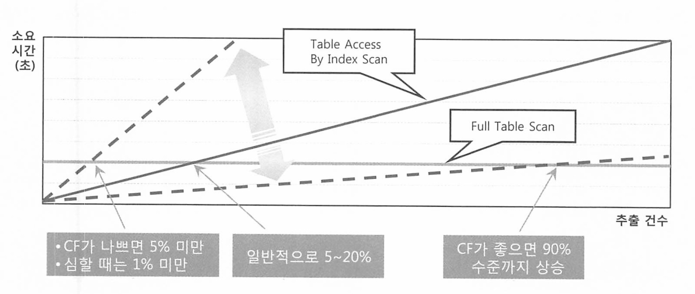

* 손익분기점 %(퍼센트)
* 가져와야 할 데이터가 만건만 넘어도 시퀀셜 액세스와 멀티블록 I/O를 이용한 풀 테이블 스캔이 빠를 수 있다. 


### OLTP 프로그램 튜닝 vs 배치 프로그램 튜닝

OLTP는 보통 소량 데이터를 읽고 갱신하므로 인덱스를 효과적으로 사용하는것이 중요하다. 

배치 프로그램은 항상 전체범위 기준으로 튜닝해야 한다. 처리대상중 일부가 목표가 아닌, 전체를 빠르게 처리하는것을 목표로 삼아야 한다.

* 이경우 FULL SCAN과 해시 조인이 유리하다.

그렇다고 배치 프로그램에서 초 대용량 테이블을 FULL SCAN하면 오래 기다려야 하므로 파티셔닝, 병렬처리 등을 골라 풀스캔해서 빠르게 처리하는것이 좋다. 

### 3.1.4 인덱스 컬럼 추가

EMP 테이블에 DEPTNO + JOB으로 구성한 인덱스가 있다.

이때 아래 쿼리를 수행하려고 한다.

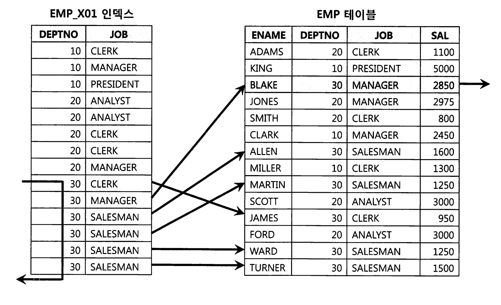

```
SELECT * FROM EMP WHERE DEPNO = 30 AND sal >= 2000
```

만족하는 사원은 1명뿐인데, sal 조건때문에 테이블을 6번 액세스 했다. 

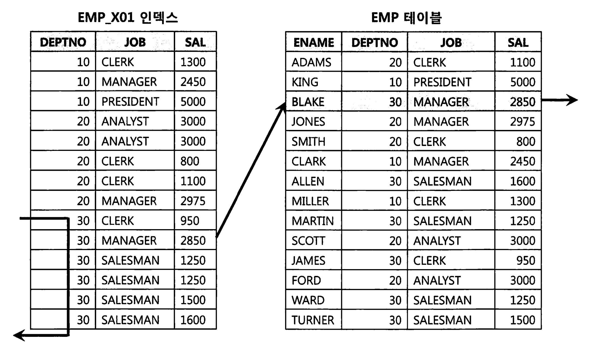

이런경우 그냥 기존 인덱스에 SAL 컬럼을 추가해주는것만으로도 큰 효과를 얻을 수 있다. 인덱스 스캔은 줄지 않지만 테이블 I/O가 줄기 때문이다 

### 3.1.5 인덱스만 읽고 처리

위 사례는 액세스 단계 필터 조건에 의해 버려지는 레코드가 많을 때, 인덱스에 컬럼을 추가함으로써 얻는 성능 효과를 보았다.

그러나 테이블 랜덤 I/O가 많아도, 필터 조건에 의해 버려지는 레코드가 없다면 그것은 비효율적인것은 아니다.

이때는 어떻게 튜닝해야 할까?

반드시 성능을 개선해야 한다면, 쿼리에 사용된 컬럼을 모두 인덱스에 추가해서 테이블 액세스가 아예 발생하지 않게 하는 방법을 고려할 수 있다.

-> 커버링 인덱스. 


### 3.1.6 인덱스 구조 테이블

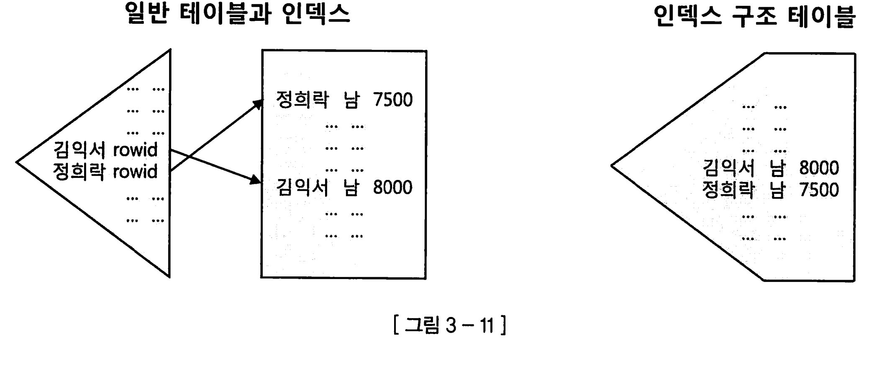

랜덤 액세스가 발생하지 않도록 테이블을 인덱스 구조로 생성한 것을 IOT(Index-Organized Table)이라고 부른다.

테이블 블록에 있어야할 데이터를 인덱스 리프 블록에 모두 저장하고 있다. 

즉 인덱스 리프블록이 곧 데이터블록이다. 

* 테이블 데이터가 기본 키에 따라 인덱스에 물리적으로 정렬되어 저장된다.

* 보조 인덱스 같은경우, pk를 통해 데이터를 다시 조회해야 한다.  

* 세컨더리 인덱스의 리프 노드에는 인덱스 키 값과 함께 이 논리적 ROWID가 저장된다. 

* 세컨더리 인덱스를 통해 조회 시, 먼저 논리적 ROWID를 얻는다.

  이 논리적 ROWID를 사용하여 IOT의 프라이머리 키 인덱스를 검색한다.

  프라이머리 키 인덱스에서 실제 데이터 레코드를 찾는다.

> Mysql의 클러스터링 테이블과는 조금 다르다. 
> 용어와 구현 세부 사항이 다를 뿐, 개념적으로는 유사한 방식으로 데이터를 저장하고 접근한다.  


### 3.1.7 클러스터 테이블

오라클의 클러스터 테이블에는 인덱스 클러스터와 해시 클러스터 두가지가 있다.


인덱스 클러스터 테이블은 클러스터 키 값이 같은 레코드를 한 블록에 모아서 저장하는 구조다. 

> 이름 때문에 SQL 서버나 Sybase에서 말하는 '클러스터형 인덱스(Clustered Index) 와 같다고 생각할지 모르지만 클러스터형 인덱스는 오히려 IOT에 가깝다. 
>
> 오라클 클러스터는 키 값이 같은 데이터를 같은 공간에 저장해 둘 뿐, IOT나 클러스터형 인덱스처럼 정렬하지는 않는다.

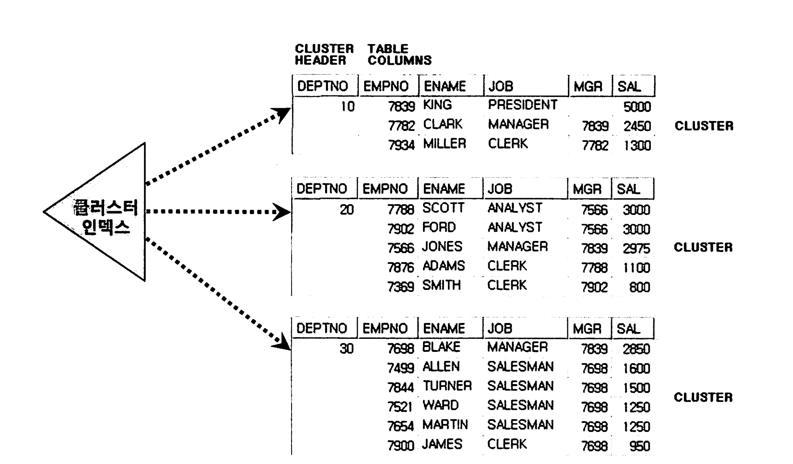

일반 테이블에 생성한 인덱스 레코드는 테이블 레코드와 1:1관계를 갖지만, 클러스터 인덱스는 1:M 관게를 갖는다. (블록을 가리키는 말 같은데..? )

클러스터 인덱스의 키 값은 항상 Unique하다. 

이런 특성 때문에 클러스터 인덱스 스캔시 랜덤 액세스가 값 하나당 한번씩 밖에 발생 안하고, 도달해서 시퀀셜 스캔하기 때문에 비효율이 없다. 


**해시 클러스터 테이블**

해시 클러스터는 인덱스를 사용하지 않고 해시 알고리즘을 사용해 클러스터를 찾아간다는점만 다르다.

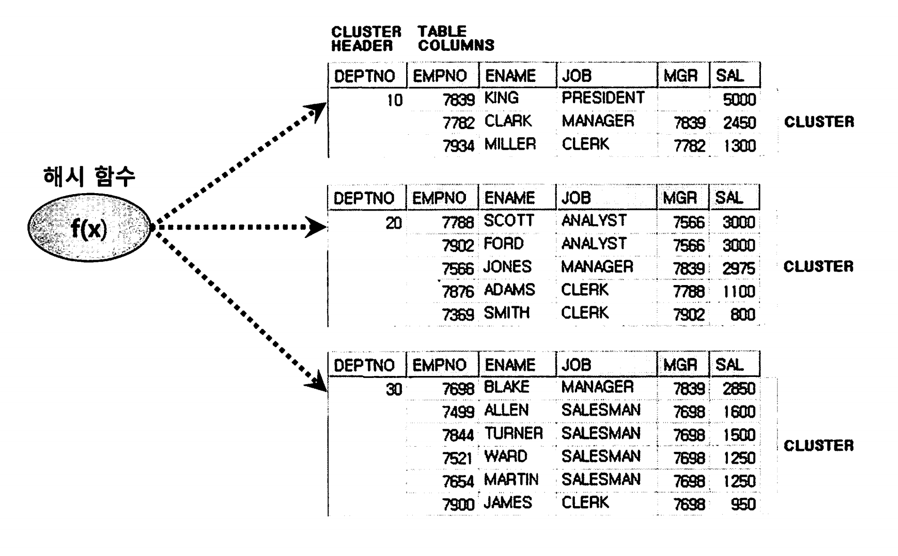

## 3.2 부분범위 처리 활용

부분범위 처리원리를 활용하면 인덱스로 액세스할 대상 레코드가 아무리 많아도 아주 빠른 응답속도를 낼 수 있다. 

### 3.2.1 부분범위 처리

모든 DBMS는 데이터를 조금씩 나눠서 전송한다. 페이징과는 다르다. 결과집합을 조금씩 나눠서 전송한다

* dbms마다 다른듯?

중간에 멈췄다가 사용자의 추가 요청이 있을때마다 데이터를 가져오도록 구현한다. 

```java
String sql = "select...from..";
Statement stmt = con.createStatement();
stmt.setFetchSize(10);
```

## 3.3 인덱스 스캔 효율화

> 점선 ---> 은 시작점을 찾는 과정을 묘사한것이다. 

인덱스 탐색 과정을 좀더 깊게 그림으로 해석해본다. 

### 3.3.1 인덱스 탐색

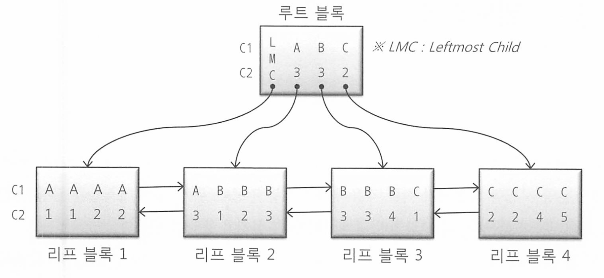

* 루트 블록 C1, C2 컬럼이 각각 (A, 3), (B, 3) (C,2)인 레코드가 있다. 각 레코드는 하위 노드를 가리키는 블록 주소를 갖는다. 
* LMC는 레프트 모스트 차일드 레코드로, 자식 노드 중 가장 왼쪽에 있는 블록을 가리킨다. 

**< 조건절 1>**

```
WHERE C1 = 'B'
```

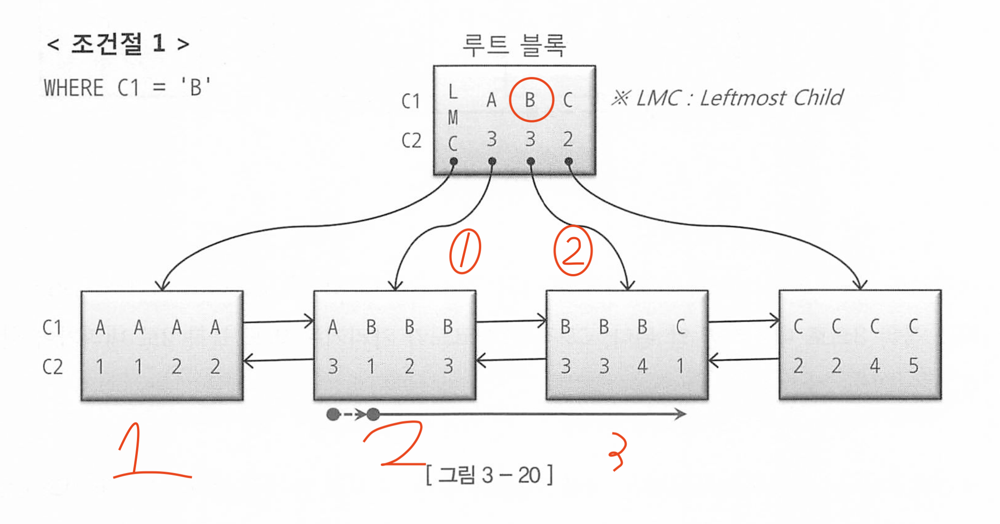

C1 = B 레코드 찾았을 때, 바로 리프블록3으로 가면 안됀다. C1 ='A'레코드가 가리키는 리프블록 2로 먼저 내려가야 한다.

하위블록에 저장된 값들을 보면 그 사실을 쉽게 볼 수 있다.

* BTree는 밸런스드 트리로, 해당 값이거나, 해당값 보다 작은 값들은 왼쪽 노드에 있다.
* 2번째 블록을 보면 C1이 B인 블록들이 있다. 
* 즉 (A,3)에는 (A, 3)부터 시작하고 (이상), (B, 3)이하인 값들이 있다. (B,3)은 (B, 3)부터 시작하고, (C,2)이하인 값들이 있다.  

수직적 탐색은 스캔 시작점을 찾는 과정이다. 

**< 조건절 2>**

```
WHERE C1 = 'B'
AND C2 = 3
```

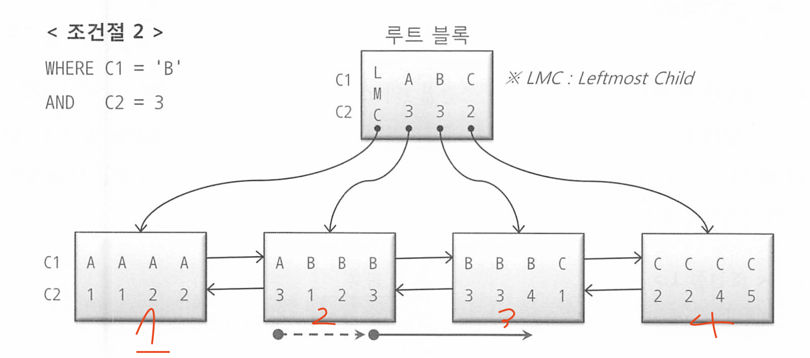

조건절 2의 스캔 시작점과 끝점은 그림과 같다.

수직 탐색을 통해 C1 = B이고 C2 = 3인 첫번째 레코드를 찾고, C1 = B인 레코드 중에서 C2 = 4인 레코드를 만나는 순간 스캔을 멈춘다.

* 그림을 보면 화살표가 `C1= C를 만나고,  스캔을 멈췄다`. 즉 스캔량을 줄였다 (조건절은 C1 = B 니까) 
* 또한 C2 =3이 아니고 C2가 4이므로 B,4까지만 스캔을 하고 멈췄다. 

**< 조건절 3>**

```
WHERE C1 = 'B'
AND C2 >= 3
```

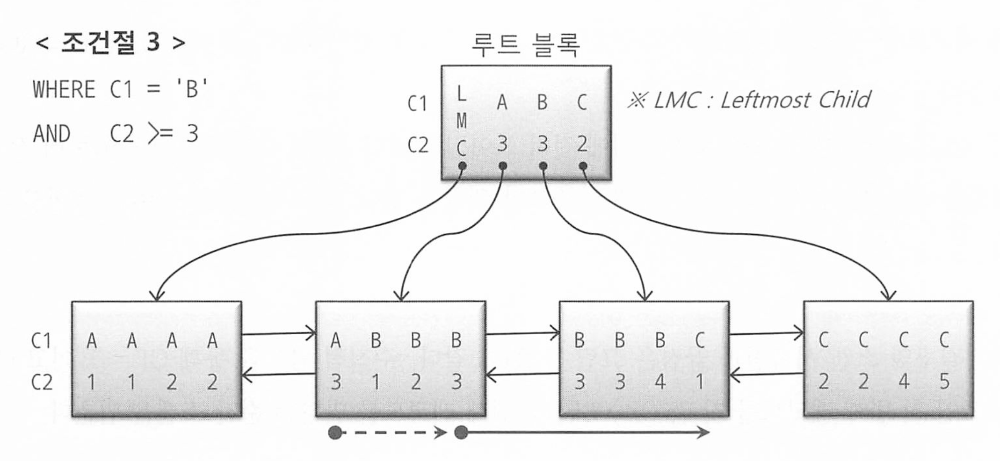

여기서도 마찬가지다. C2 >= 3조건절이 스캔을 멈추는데는 역할을 못하지만, 조건절 1과 다르게 스캔 시작점(실선)이 달라졌다.

조건절 덕분에 스캔 시작점을 명확히 지정할 수 있었다. 


**< 조건절 4>**

```
WHERE C1 = 'B'
AND C2 <= 3
```

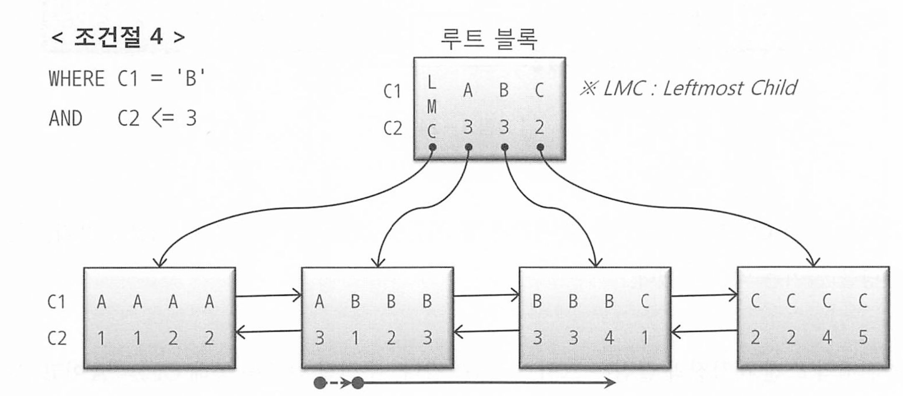

수직 탐색을 통해 C1 = B 인 첫번째 레코드를 찾고 스캔하다가 C2 > 3인 레코드를 만나자마자 스캔을 멈췄다.

C2 <= 3인 조건절은 수직 탐색 과정에 전혀 쓰이지 않아 스캔 시작점을 결정하는데 도움은 되지 못했지만, 스캔을 멈추는데에는 중요한 역할을 했다. 

### 3.3.2 인덱스 스캔 효율성

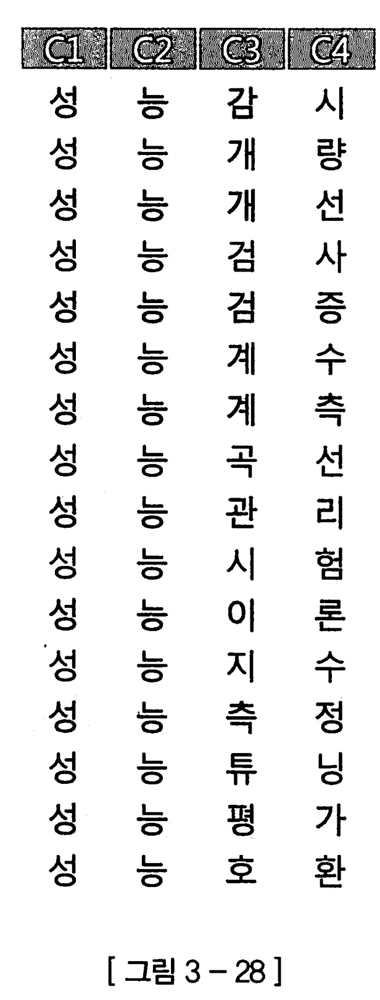

1. 이 테이블에서 성능검 으로 시작하는 레코드를 검색하려면 어디서 스캔을 시작하고 어디서 멈출까?

2. 이테이블에서 성능으로 시작하고 선으로 끝나는 레코드를 검색하려면 어디서 스캔을 시작하고 어디서 멈출까?

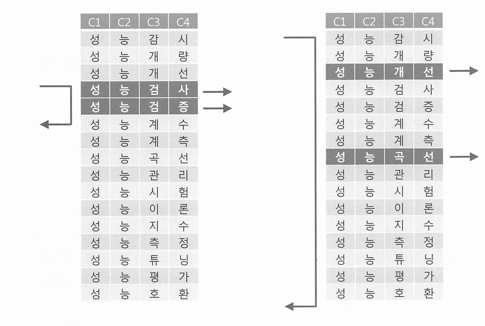

1. 성능검으로 시작하는 레코드는 인덱스 수직 탐색을 통해 바로 성능검사 레코드를 찾고 스캔을 시작해 성능계수까지 총 3개 스캔하고 멈춘다. 두건을 얻기위해 3건을 스캔한다
2. 성능으로 시작하는 모든 레코드를 스캔한다. 결과는 두건이지만 더 많은 레코드를 스캔해야 했다. 


결론적으로, 인덱스가 효율이 좋은지 나쁜지는 얻은 레코드가 몇개인데 블록을 얼마나 읽었는지에 따라 다르다.

결과가 어찌됐든 인덱스 블록을 적게 읽은것이 좋다. 

### 3.3.3 액세스 조건과 필터 조건

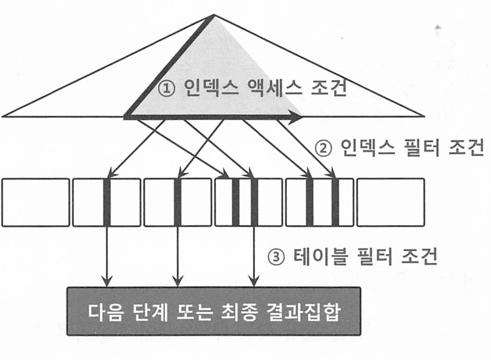

**인덱스 액세스 조건** : 인덱스 스캔 범위를 결정하는 조건절

인덱스 수직 탐색을 통해 스캔 시작점을 결정하는데 영향을 미치고, 리프 블록을 스캔하다가 어디서 멈출지 결정하는데 영향을 미친다


**인덱스 필터조건** : 테이블로 액세스할지를 결정하는 조건이다. 

인덱스 필터 조건은 인덱스를 통해 검색된 후 추가적으로 필터링되는 조건으로, 인덱스 액세스 조건으로 검색된 결과 집합에서 추가적인 필터링을 수행한다. 


**테이블 필터 조건** : 쿼리 수행 다음 단계로 전달하거나, 결과 집합에 포함할지 결정하는 조건이다. 

테이블 필터 조건은 인덱스를 통해 검색된 행을 테이블에서 다시 읽어와서 적용되는 조건


인덱스 액세스 조건과 필터 조건을 효과적으로 사용하면 데이터베이스가 불필요한 행을 읽지 않게 되어 성능이 크게 향상된다. 

**테이블 필터 조건**은 인덱스로는 처리할 수 없는 추가적인 조건을 테이블 레벨에서 적용하는 방식이다. 

### 3.3.4 비교 연산자 종류와 컬럼 순서에 따른 군집성

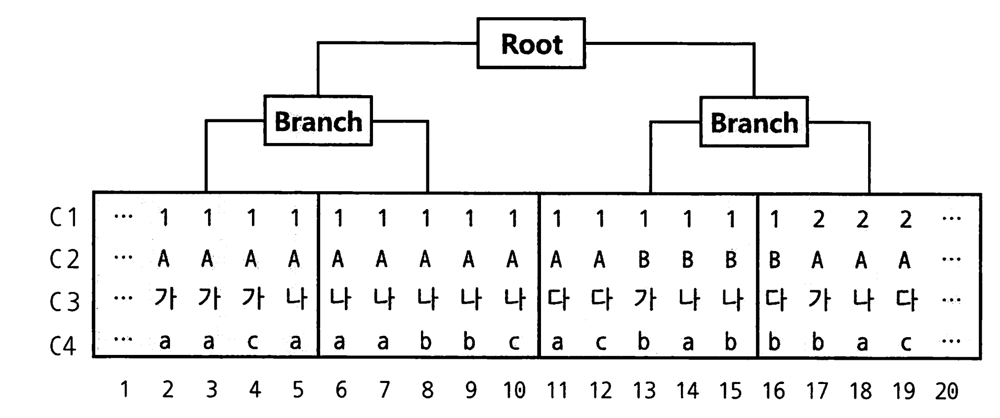

* 편의상 부여한 일련번호다. C1~C4는 컬럼이다.

특정 인덱스 블록에 데이터가 모여있게 되는데, 조건절에 따라 레코드가 서로 흩어진 블록을 조회하게 된다.

앞쪽부터 누락없이 = (이퀄)로 조회하면 레코드는 모여있지만, 누락하거나 = 조건이 아닌 연산자로 조회하면 조건절을 만족하는 레코드가 서로 흩어지게 된다. 

예를들어 다음과 같은 쿼리 두가지에 따라 천차 만별이 된다

```sql
where c1 = 1 and c2 = 'A' and c3 = '나' and c4 = 'a'

where c1 = 1 and c2 <= 'b' c3 = '나' c4 between 'a' and 'b'
```

선행 컬럼이 모두 '=' 조건인 상태에서 첫 번 째 나타나는 범위검색 조건까지만 만족하는 인덱스 레코드는 모두 연속해서 모여 있지만, 그 이하 조건까지 만족하는 레코드는 비교 연산자 종류에 상관없이 흩어진다

```sql
where c1 between 1 and 3 and c2 ='A' and c3 = '나'
```


인덱스 스캔 범위를 결정하는 조건절이 인덱스 액세스 조건이다.

선행 컬럼이 모두 = 조건인 상태에서 첫 번째 나타나는 범위 검색 조건이 인덱스 스캔 범위를 결정한다.

* c1 between 1 and 3이 스캔 범위를 결정하는 인덱스 액세스 조건이다
* 나머지 조건들은 인덱스 필터 조건이 된다. 

간단하게 생각해서, 첫번쨰로 나타나는 범위검색 조건까지가 인덱스 액세스 조건이고, 나머지는 필터 조건이라고 생각하면 된다. 

#### 예시 1: 결합 인덱스 (col1, col2, col3)가 있는 경우

```sql
SELECT * FROM my_table WHERE col1 = 'A' AND col2 > 'B' AND col3 = 'C';
```

- **인덱스 액세스 조건**: `col1 = 'A'`와 `col2 > 'B'`
  - 이 조건들은 인덱스를 통해 데이터를 찾는 데 사용된다.
  - 인덱스가 (col1, col2, col3) 순서로 구성되어 있으므로 `col1`과 `col2`를 사용하여 데이터를 검색할 수 있다.
- **필터 조건**: `col3 = 'C'`
  - 이 조건은 인덱스를 통해 찾은 데이터에서 추가적으로 필터링하는 데 사용된다.
  - `col2` 이후 첫 번째 범위 검색 조건(`col2 > 'B'`)이 나타나면 그 이후 조건들은 인덱스를 통해 직접 검색되지 않고, 필터 조건으로 처리된다.

#### 왜 성능에 영향을 미치는가?

- **인덱스 액세스 조건**은 인덱스를 사용하여 데이터를 빠르게 찾을 수 있게 한다.. 인덱스는 정렬된 구조를 가지고 있기 때문에, 인덱스 액세스 조건을 사용하면 데이터베이스가 원하는 데이터를 찾기 위해 빠르게 탐색할 수 있다.
- **필터 조건**은 인덱스를 통해 검색된 데이터에서 추가적으로 조건을 적용하는 것이므로, 인덱스 액세스 조건만큼 효율적이지 않다. 이는 추가적인 데이터 필터링 작업이 필요하기 때문에 더 많은 리소스를 사용하게 된다. 읽고 버리는 작업등을 하기 때문이다.
- 범위 검색 조건(`>` 또는 `<` 등)이 나타나는 순간 이후의 조건들은 더 이상 인덱스 액세스 조건으로 처리되지 않기 때문에, 인덱스의 효율적인 탐색 능력을 사용하지 못하고, 결과적으로 성능 저하가 발생할 수 있다.


### 3.3.5 인덱스 선행 컬럼이 등치(=) 조건이 아닐 때 생기는 비효율

인덱스 스캔 효율성을 인덱스 컬럼을 조건절에 모두 등치(=)로 쓸때 가장 좋다

부등호(≠)나 범위 조건(>, <, >=, <=)을 사용하면 인덱스의 효율성이 떨어지게된다.

### 비효율의 이유: 부등호와 범위 조건

- **부등호 조건(≠)**: 인덱스가 모든 값을 검사해야 한다. 특정 값을 제외한 나머지 모든 값을 검색해야 하므로 인덱스 스캔 범위가 넓어진다.
- **범위 조건(>, <, >=, <=)**: 범위 조건은 특정 범위 내의 모든 값을 검색해야 하므로 인덱스 스캔 범위가 넓어진다. 이는 인덱스의 리프 노드를 많이 탐색하게 되어 효율성이 떨어진다.

부등호 조건 예시

```sql
-- 인덱스: (col1, col2)
EXPLAIN SELECT * FROM my_table WHERE col1 != 'A';
```

* col1 ≠ 'A'를 만족하는 모든 행을 검색해야 하므로 디스크 I/O가 증가하고 성능이 저하됌

### 3.3.6 BETWEEN을 IN-List로 전환

범위 검색 컬럼이 맨 뒤로 가도록 변경할 수 없는 경우에, between 조건을 IN-List로 바꿔주면 효과를 얻는 경우가 있다.

#### BETWEEN 사용 예시

```sql
-- 인덱스: (col1, col2)
EXPLAIN SELECT * FROM my_table WHERE col1 BETWEEN 'A' AND 'C' AND col2 = 'B';
```

* BETWEEN 조건은 col1의 범위 'A'에서 'C'까지의 모든 값을 검색한다. 이는 인덱스를 사용하지만 범위 스캔이므로 디스크 I/O가 많아질 수 있다.

#### IN-List로 전환 예시

```sql
-- 인덱스: (col1, col2)
EXPLAIN SELECT * FROM my_table WHERE col1 IN ('A', 'B', 'C') AND col2 = 'B';
```

* IN-List 조건은 col1이 'A', 'B', 'C'인 경우를 각각 등치 조건으로 처리해서  데이터베이스는 각 값에 대해 인덱스를 사용하여 별도로 빠르게 접근할 수 있다.


내부적으로 =(등치)로 변환해서 여러번 수직적 탐색 후 스캔하기 때문에 훨씬 빠르다.

그러나 between 조건을 IN-LIST로 조건으로 바꿀시 주의할 점은, IN절에 들어가는 조건이 많지 않아야 한다.

IN절 만큼 브랜치 블록을 반복 탐색하는 비효율이 커질 수 있기 때문이다. 

때문에, IN절로 변환시 조건절이 적어야 하기도 하고, 데이터 분포가 소량이여서 블록을 너무 많이 읽지 않도록 하는것이 좋다. 

### 3.3.7 Index Skip Scan 활용


### 3.3.8 IN 조건은 ‘=’인가

사실 IN  조건은 =이 아니다. 인덱스를 어떻게 구성하느냐에 따라 성능이 달라질수도 있따.

아래 SQL에 대한 인덱스를 상품ID + 고객번호로 설계할 떄와 고객번호 + 상품ID로 설게할 때 차이가 있는지 보면 알 수 있따.

```sql
SELECT *
FROM 고객별 상품
WHERE 고객번호 =:cust_no
AND 상품 ID IN('NH00037', 'NH00041', 'NH00050')
```

* 고객번호의 평균 카디널리티는 3이라고 가정 = 고객별로 평균 3건의 상품 가입 
* 인덱스를 상품ID + 고객번호로 설정시 같은 상품은 고객번호 순으로 정렬된 상태로 저장
* 반대로 고객번호 + 상품ID로 설정시 같은 고객번호가 상품 ID에 따라 뿔뿔이 흩어진다.

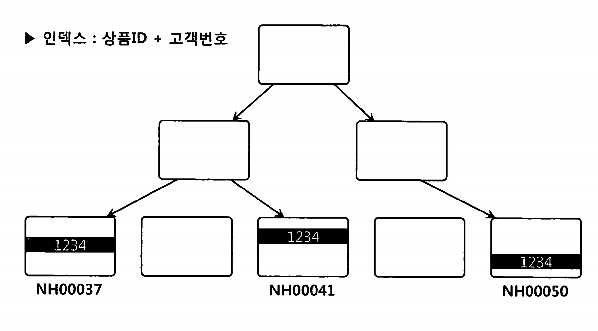

인덱스가 상품ID + 고객번호로 구성돼 있다면 상품ID 조건절이 IN절로 풀리는것이 효과적이다. 고객번호 1234 조건을 만족하는 레코드가 서로 흩어져 있기 때문이다.

* 그림을 보면 인덱스를 수직적으로 3번 탐색하며, 그 과정에서 총 9개 블록만 액세스함 (루트부터 시작해서 1, 2, 4 / 1, 2,6 / 1,3, 8)

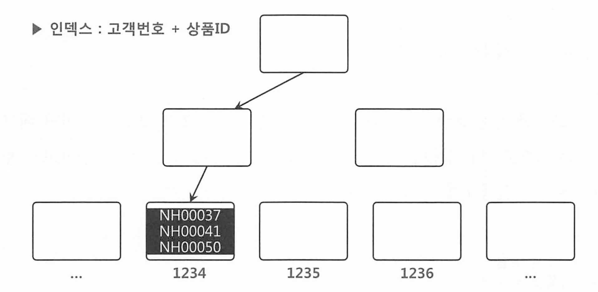

반대로 고객번호 + 상품ID로 두게되면 같은 고객은 상품ID순으로 정렬된 상태로 같은 리프블록에 저장된다. 

여기서도 상품ID를 IN절로 풀면, 인덱스를 수직적으로 세번 탐색하는 과정에 9개 블록을 읽는다. (IN 절을 =로 하게되서 여러번 탐색하는것 )

IN List Iterator절로 풀지 않으면, 상품ID조건절은 필터로 처리한다. 

그러면 고객번호만 액세스 조건이므로 고객번호 = 1234인 레코드를 모두 스캔한다. (오히려 효율적임. )

같은 고객은 한 블록(또는 연속된 블록)에 모여있으므로, 블록I/O는 수직 탐색과정을 포함 3,4개만 발생한다. 


중요한것은. IN조건은 =이아니고, IN 조건이 =이 되려면, 각 IN절 값에 대해 인덱스 액세스를 해서(=로 반복적) 효과적이다. 


### 3.3.9 BETWEEN과 LIKE 스캔 범위 비교

결론부터 말하면 Between이 LIKE보다 낫다. 


### 3.3.11 다양한 옵션 조건 처리 방식의 장단점 비교

**인덱스 선두 컬럼에 OR 조건을 사용하지 말자.** 

인덱스에 포함되지 않은 컬림에 대한 옵션 조건은 어차피 테이블에서 필터링할 수밖에 없으 므로 그럴 때는 OR 조건을 사용해도 무방하다. OR 조건을 활용한 옵션 조건 처리를 정리하 면 다음과 같다.

- 인덱스 액세스 조건으로 사용 불가
- 인덱스 필터 조건으로도 사용 불가
- 테이블 필터 조건으로만 사용 가능


**LIKE/BETWEEN 패턴을** 사용하고자 할 때는 아래 네 가지 경우에 속하는지 반드시 점검해야 한다. (BETWEEN 조건은 1번과 2번 조전에 해당하는지만 점검하면 된다.)

1. 인덱스 선두 컬럼
2. NULL 허용 컬럼
3. 숫자형 컬럼
4. 가변 길이 컬럼

### 3.3.12 함수호출부하 해소를 위한 인덱스 구성

PL/SQL 사용자 정의 함수는 생각하는것보다 매우 느리다.

PL/SQL 사용자 정의 함수가 느린 데는 아래 3가지 이유가 있다.

1. 가상머신(VM) 상에서 실행되는 인터프리터 언어
2. 호출 시마다 컨텍스트 스위칭 발생
3. 내장 SQL에 대한 Recursive Call 발생 (함수나 SQL을 사용하면, 조건을 만족하는 결과가 100만건이면 100만번 실행함)
