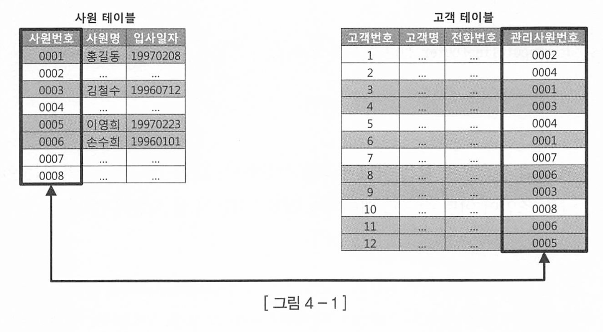
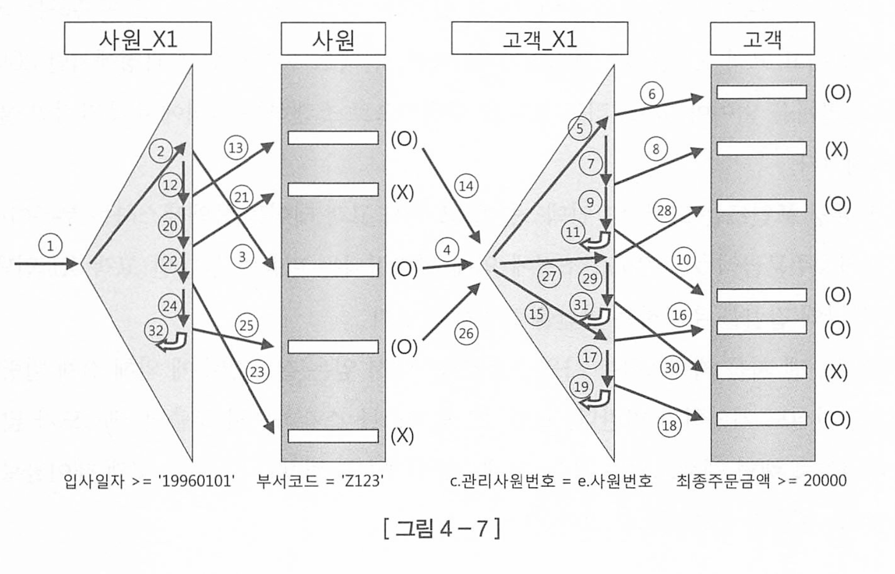
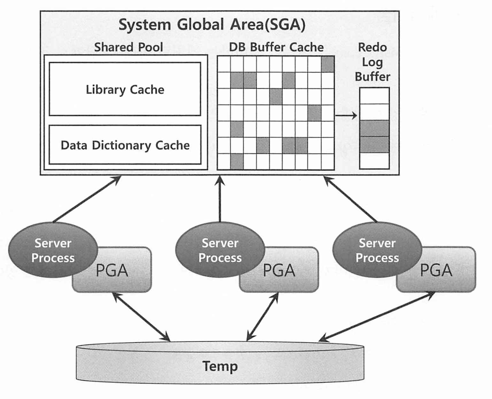
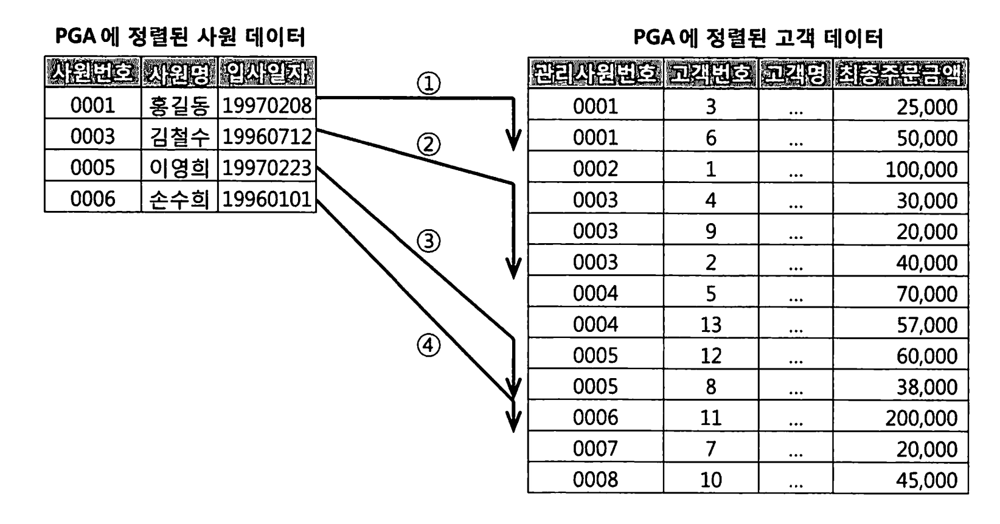
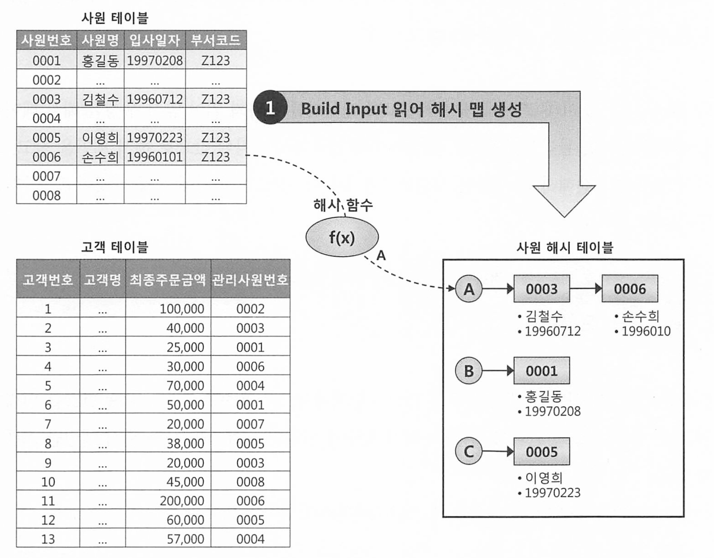
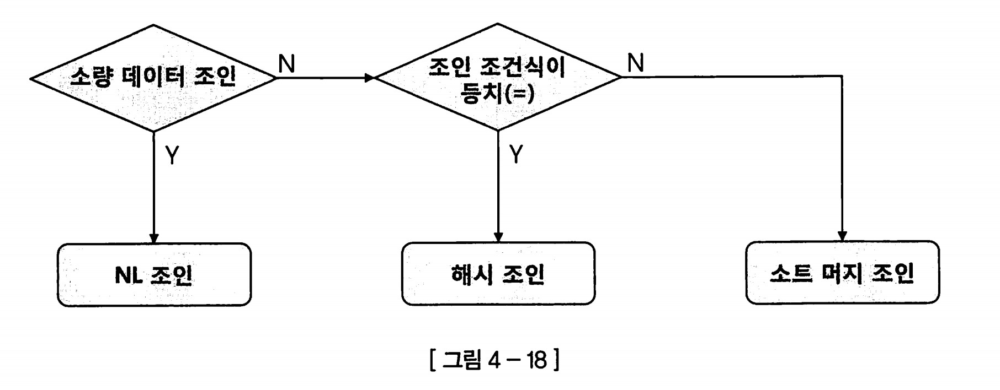

# 4장. 조인 튜닝

## 4.1 NL 조인

네스티드 루프 조인은 조인의 기본이다. NL조인은 인덱스를 이용한 조인이다. 

### 4.1.1 기본 메커니즘



* 사원테이블의 기본키를 고객테이블의 관리사원번호라는 컬럼이 외래키로 맺고있음.

이 둘을 조인한다면?

```
# C/ JAVA
for (int i = 0; i < 100; i++) { 
    // outer loop
    for (int j = 0; j < 100; j++) { 
        // inner loop
        // Do Anything ...
    }
}

# PL/SQL
BEGIN
    FOR outer IN 1..100 LOOP
        FOR inner IN 1..100 LOOP
            dbms_output.put_line(outer || ' : ' || inner);
        END LOOP;
    END LOOP;
END;
```

* 슈도코드일뿐, 실제로 이렇게 반복수행하진 않는다. 

중첩 루프문을 사용해서 하는 조인이다.

NL조인은 아우터와 이너 테이블 모두 인덱스를 이용한다. 아우터 테이블의 사이즈가 크지 않으면 인덱스를 이용하지 않을수도 있다. 

반면, 이너테이블은 인덱스를 사용해야 한다. 이너 루프에서 위 예제의 관리 사원번호(외래키)로 데이터 검색시 인덱스를 이용하지 않으면, 아우터에서 읽은 건수만큼 풀 스캔을 반복하기 때문이다.

### 4.1.2 NL 조인 실행계획 제어

NL조인을 힌트로 제어할 수 있다.

```sql
# 오라클
SELECT /*+ ordered use_nl(c) */
    e.사원명, c.고객명, c.전화번호
FROM
    사원 e, 고객 c
WHERE
    e.입사일자 >= '19960101'
    AND c.관리사원번호 = e.사원번호;
    
    
```

* ordered 힌트는 FROM절에 기술한 순서대로 조인하라고 하는것. 
* 사원 테이블(Driving, outer) 기준으로 고객 테이블(driven, inner)과 NL 조인하라고 하는것이다.

비슷한 다른 언어로는

```sql
# Postgresql 
SET enable_hashjoin = OFF;
SET enable_mergejoin = OFF;

SELECT
    e.사원명, c.고객명, c.전화번호
FROM
    사원 e
JOIN
    고객 c ON c.관리사원번호 = e.사원번호
WHERE
    e.입사일자 >= '19960101';
-- SET enable_hashjoin = OFF;와 SET enable_mergejoin = OFF;를 사용하여 다른 조인 방법을 비활성화하고 NL 조인을 유도

# mysql 
SELECT STRAIGHT_JOIN
    e.사원명, c.고객명, c.전화번호
FROM
    사원 e
JOIN
    고객 c ON c.관리사원번호 = e.사원번호
WHERE
    e.입사일자 >= '19960101';
-- STRAIGHT_JOIN을 사용하면 MySQL이 조인의 순서를 그대로 유지
```

### 4.1.3 NL 조인 수행 과정 분석

아래와 같이 조건절을 추가한 경우 조건절 비교 순서는 어떻게 될까?

```sql
SELECT /*+ ordered use_nl(c) index(e) index(c) */
    e.사원번호, 
    e.사원명, 
    e.입사일자, 
    c.고객번호, 
    c.고객명, 
    c.전화번호, 
    c.최종주문금액
FROM
    사원 e, 고객 c
WHERE
    c.관리사원번호 = e.사원번호      -- 1
    AND e.입사일자 >= '19960101' -- 2
    AND e.부서코드 = '7123'      -- 3
    AND c.최종주문금액 >= 20000;  -- 4

# 인덱스
* 사원_PK : 사원번호
* 사원_X1 : 입사일자
* 고객_PK : 고객번호
* 고객_X1 : 관리사원번호
* 고객_X2 : 최종주문금액
```

* 두 테이블 모두 인덱스 명시했으므로 인덱스를 사용해서 액세스한다. 인덱스명은 명시하지 않아서 옵티마이저가 결정한다. 

```
| Id | Operation                        | Name    | Rows | Bytes | Cost |
|----|----------------------------------|---------|------|-------|------|
|  0 | SELECT STATEMENT                 |        |    5 |    58 |    5 |
|  1 |   NESTED LOOPS                   |        |    5 |    58 |    5 |
|  2 |    TABLE ACCESS BY INDEX ROWID   | 사원    |    3 |    20 |    2 |
|  3 |     INDEX RANGE SCAN             | 사원_X1 |    5 |       |    1 |
|  4 |    TABLE ACCESS BY INDEX ROWID   | 고객    |    5 |    76 |    2 |
|  5 |     INDEX RANGE SCAN             | 고객_X1 |    8 |       |    1 |
```

Sql 조건절 우측에 표시한 번호로 조건절 비교 순서를 나열하면, 2 - 3 - 1 - 4 순이 다.

1. **조건절 번호 ②**: `입사일자 >= '19960101'` 조건을 만족하는 레코드를 찾기 위해 `사원_X1` 인덱스를 Range 스캔한다. (실행 계획 ID = 3)
2. **조건절 번호 ③**: `사원_X1` 인덱스에서 읽은 ROWID로 `사원` 테이블을 액세스해서 `부서코드 = '7123'` 필터 조건을 만족하는지 확인한다. (실행 계획 ID = 2)
3. **조건절 번호 ①**: `사원` 테이블에서 읽은 `사원번호` 값으로 조인 조건(`c.관리사원번호 = e.사원번호`)을 만족하는 `고객` 쪽 레코드를 찾기 위해 `고객_X1` 인덱스를 Range 스캔한다. (실행 계획 ID = 5)
4. **조건절 번호 ④**: `고객_X1` 인덱스에서 읽은 ROWID로 `고객` 테이블을 액세스해서 `최종주문금액 >= 20000` 필터 조건을 만족하는지 확인한다. (실행 계획 ID = 4)

각 단계를 완료하고 다음 단계로 넘어가는게 아니고, 한 레코드씩 순차적으로 실행한다. 



결론적으로, 드라이빙 테이블의 인덱스를 이용해서 접근하고, 필터링 한 후에

조인을 위해 드리븐 테이블의 외래키 인덱스를 이용하여 range 스캔 후 마지막 드리븐 필터 조건을 이용해서 걸러낸다. 

### 4.1.4 NL 조인 튜닝 포인트

첫번째 튜닝 포인트는 **랜덤 액세스를 줄이는 것**이다.

두번째 튜닝 포인트는 **조인 액세스 횟수를 줄여야 한다**. 조인 액세스 횟수는 Outer 테이블을 읽고 필터링한 결과 건수에 의해 결정된다.  - 드라이빙 테이블의 접근 결과를 줄이자.

세번째 튜닝 포인트는 드리븐 테이블의 인덱스를 읽고 액세스 하는 부분이다. 만약 액세스 후 필터링되어 걸러지는 비율이 높다면, 그만큼 쓸데없이 테이블에 액세스 많이 해서 블록 I/O가 발생한 것이므로 필터링 조건을 인덱스에 넣어서 I/O를 줄여야 한다(복합 인덱스를 일부러 조인용으로 만드는것)

마지막으로, 맨 처음 드라이빙 테이블에 액세스하는 인덱스에 의해 얻은 결과 건수에 의해 전체 횟수가 좌지우지 된다는 것을 기억하자. (드라이빙 테이블에서 조건에 의해 뽑은 로우 수만큼 반복해서 드리븐 테이블을 탐색한다) 

### 4.1.5 NL 조인 특징 요약

첫번째 특징은 랜덤 액세스 위주의 조인 방식이다. 레코드 하나를 읽으려고 블록을 통째로 읽는 방식이다. 인덱스 구성이 완벽해도, 대량 데이터 조인시 NL 조인이 불리한 이유다

두번째 특징은 조인을 한 레코드씩 순차적으로 진행한다.  첫번째 특징인 랜덤 액세스 위주 조인 때문에 대량 데이터 처리시 치명적이지만, **부분범위 처리가 가능한 상황**에서 한 레코드씩 순차적으로 처리해서 매우 빠른 응답 속도를 낼 수 있다. 

* 부분범위 처리 : 전체 데이터 집합 중 일부 범위만을 처리하는것
  * 예를들어 LIMIT 이라던가, 백만개 드라이빙 테이블 중 소량만 접근하는 조건을 준다던가

### 4.1.7 NL 조인 확장 메커니즘

오라클 관련 내용이라 생략한다. 

오라클에서는 NL조인 성능을 높이기 위해 테이블 Prefetch, 배치 I/O 기능이 추가됐따고 하는데 

**MySQL**은 **BKA**와 **MRR** 등의 기능을 통해 NL 조인의 I/O 성능을 최적화한다.

**PostgreSQL**은 **Parallel Query Execution**과 **JIT Compilation**을 통해 NL 조인을 포함한 쿼리의 성능을 높이고, **향상된 버퍼 관리**를 통해 효율적인 데이터 접근을 지원한다.

* **Parallel Query Execution**은 PostgreSQL에서 여러 코어를 활용하여 대용량 데이터를 병렬로 처리함으로써 쿼리 성능을 향상시키는 기능

  * 멀티 프로세스 디비이다.
  * 쿼리의 각 단계, 예를 들어 조인이나 스캔 등의 작업을 여러 프로세스가 동시에 수행 

* BKA는 여러 개의 검색 키를 한 번에 묶어서 처리하는 방식으로, 한 번의 I/O로 여러 행을 가져와서  큰 테이블을 조인할 때 I/O 작업을 줄여 성능을 향상

* **Multi-Range Read (MRR)**는 비순차적인 인덱스 조회 성능을 향상시키기 위한 기능.

  MRR은 범위 스캔 시 디스크 접근을 최적화하여, 필요한 데이터 블록을 한 번에 읽어온다.


왜 조인문을 아래와 같이 기록하는 습관이 좋을까? (외부 테이블을 오른쪽으로)

```sql
select *
from PRA_HST_STC a, ODM_TRMS b
where a.SALE_ORG_ID = :sale_org_id
and b.STRD_GRP ID = a.STRD_GRP ID
and b.STRD_ID = a.STRD_ID
order by a.STC_DT desc
```

* NL 조인에서 외부 테이블이 먼저 스캔되고, 그 후 내부 테이블에서 조인 조건에 맞는 데이터를 찾는다.
* `PRA_HST_STC a`가 외부 테이블이고, `ODM_TRMS b`가 내부 테이블이다. 
  * 조인 조건에서 `b.STRD_GRP_ID = a.STRD_GRP_ID`와 `b.STRD_ID = a.STRD_ID`가 적용된다

* 조인 조건에서 `b.STRD_GRP_ID = a.STRD_GRP_ID`와 같은 조건이 있을 때, `b`가 `a`에 의존하는 내부 테이블임을 명확히 인식할 수 있다.


## 4.2 소트 머지 조인

조인 컬럼에 인덱스가 없거나, 대량 데이터 조인이어서 인덱스가 효과적이지 않을 때,

옵티마이저는 NL 조인 대신 소트 머지 조인이나 해시 조인을 선택한다.

**Sort-Merge Join**은 두 개의 테이블을 조인하는 방법 중 하나로, 조인할 테이블의 데이터가 정렬된 상태일 때 효율적으로 동작하는 조인 방식이다.

큰 데이터셋을 조인할 때 사용되며, 다음과 같은 절차로 수행된다. 

1. **정렬(Sort)**:
   - 조인에 참여하는 두 테이블의 조인 키를 기준으로 데이터를 정렬
     - 이 단계에서, 이미 정렬된 인덱스가 존재하면 정렬 과정이 생략될 수 있다.
2. **병합(Merge)**:
   - 두 테이블의 데이터를 정렬된 상태로 하나씩 비교하면서 병합
   - 정렬된 데이터는 빠르게 비교할 수 있기 때문에, 같은 키를 가진 데이터는 한 번의 스캔으로 결합된다 


MySQL에서는 소트 머지 조인을 지원하지 않는다. 

**PostgreSQL**는 Sort-Merge Join을 기본적으로 지원하며 **실행 계획**에서 `Merge Join`으로 표시된다. 

PostgreSQL 옵티마이저는 조인할 두 테이블이 정렬된 상태이거나, 정렬 비용이 비교적 저렴할 때 Sort-Merge Join을 선택한다.


소트머지조인과 해시 조인을 이해하려면 PGA에 대해 알아야 한다.

* **PGA**(Program Global Area)는 Oracle Database에서 사용되는 메모리 영역 중 하나로, 특정 사용자 세션에 의해 독립적으로 할당되고 사용되는 영역

### 4.2.1 SGA vs. PGA

공유 메모리 영역인 SGA(System or Shared Global Area)에 캐시된 데이터는 여러 프로세스가 공유할 수 있다.

동시에 액세스 할 수는 없다. 

데이터 블록과 인덱스 블록을 캐싱하는 DB 버퍼 캐시는 SGA의 가장 핵심적인 구성요소이며, 블록을 읽으려면 버퍼 Lock도 읽어야 한다.



오라클 서버 프로세스는 SGA에 공유된 데이터를 읽고 쓰면서, 동시에 자신만의 고유 메모리 영역을 갖는다.

이 각 서버 프로세스에 할당된 메모리 영역을 PGA(Process/Program/Private Global Area)라고 부르며 프로세스에 종속적인 고유 데이터를 저장하는 용도로 사용된다. 할당받은 PGA 공간이 적어 데이터를 모두 저장할 수 없으며 Temp 테이블 스페이스를 사용한다.


PGA는 다른 프로세스와 공유하지 않는 공간이여서 락(래치)이 불필요하며, 때문에 같은 양의 데이터를 읽더라도 SGA캐시에서 읽을때보다 훨씬 빠르다. 

### 4.2.2 기본 메커니즘

소트 머지 조인(Sort Merge Join)은 이름이 의미하는 것처럼 아래 두 단계로 진행한다.

1. 소트 단계 : 양쪽 집합을 조인 컬럼 기준으로 정렬한다.
2. 머지 단계 : 정렬한 양쪽 집합을 서로 머지(Merge)한다.

아래 소트 머지 조인과정을 보자. 소트 머지 조인을 use_merge 힌트로 유도한다

```sql
SELECT /*+ ordered use_merge(c) */
    e.사원번호, 
    e.사원명, 
    e.입사일자, 
    c.고객번호, 
    c.고객명, 
    c.전화번호, 
    c.최종주문금액
FROM
    사원 e,    고객 c 
WHERE
    c.관리사원번호 = e.사원번호
    AND e.입사일자 >= '19960101'
    AND e.부서코드 = 'Z123'
    AND c.최종주문금액 >= 20000;
```

1. 입사일자 >= '19960101' 이고 부서코드가 Z123에 **사원** 데이터를 읽어 조인 컬럼인 사원번호 순으로 정렬하고, 결과집합은 PGA 영역에 할당된 Sort Area에 할당
2. **고객** 테이블에서 고객의 최종주문금액 >= 20000인 데이터를 읽어 Sort Area에 저장 
3. PGA 또는 Temp 스페이스에 저장한 사원 데이터를 스캔하면서 PGA에 저장된 고객 데이터와 조인함. 



중요한것은, 사원 데이터 기준으로 고객을 매번 풀 스캔 하지 않는다. 고객 데이터가 정렬되어 있으므로 조인 대상 레코드가 시작되는 시점을 쉽게 찾고, 조인에 실패하는 레코드를 만나는 순간 바로 멈출 수 있다.

### 4.2.3 소트 머지 조인이 빠른 이유

소트머지조인은 Sort Area에 미리 정렬해둔 자료구조를 이용한다는 점만 다를 뿐 조인 프로세싱 자체는 NL 조인과 같다.

왜 대량 데이터 조인시 소트 머지 조인이 더 빠를까? 

NL조인은 단적으로 말해 인덱스를 이용한 조인 방식이다. 조인 과정에서 액세스하는 모든 블록을 랜덤액세스 방식으로 **건건이** DB 버퍼캐시를 경유해서 읽기 때문에 읽는 모든 블록에 래치 획득(락) 등을 통하기 때문에 느리다.

반면 소트머지 조인은 양쪽 테이블로부터 조인 대상 집합을 일괄적으로 읽어 저장한 후 조인하기 때문에, 래치 획득(락)과 같은 과정이 없으므로 훨씬 빠르다. 

소트 머지 조인도 양쪽 테이블로부터 **조인 대상 집합을 읽을 때는 DB 버퍼캐시를 경유**한다.

이때 인덱스를 이용하기도 한다. 이 과정에서 생기는 버퍼캐시 탐색 비용과 랜덤 액세스 부하는 소트 머지 조인도 피할 수 없다.

### 4.2.4 소트 머지 조인의 주용도

그러나 해시 조인이 등장한 이후로는 소트머지조인도 필요없다. 해시조인이 더 빠르기 때문이다.

그러나 해시 조인은 조인 조건식이 등치 (=)가 아닐때는 사용할 수 없다는 단점이 있다.

그래서 소트 머지 조인은 아래와 같은 상황에 주로 쓰인다.

* 조인 조건식이 등치(=)가 아닌 대량 데이터 조인
* 조건 조건식이 아예 없는 카테시안 곱, 크로스 조인

### 4.2.5 소트 머지 조인 제어하기

아래는  소트머진 조인 실행계획이다.

양쪽 테이블을 각각 소트 한 후 위쪽 사원 테이블 기준으로 아래쪽 고객 테이블과 머지 조인한다

```
Execution Plan
---------------------------------------------------------
0  SELECT STATEMENT Optimizer=ALL_ROWS
1  0 MERGE JOIN
2  1 SORT (JOIN)
3  2 TABLE ACCESS (BY INDEX ROWID) OF '사원' (TABLE)
4  3 INDEX (RANGE SCAN) OF '사원_X1' (INDEX)
5  1 SORT (JOIN)
6  5 TABLE ACCESS (BY INDEX ROWID) OF '고객' (TABLE)
7  6 INDEX (RANGE SCAN) OF '고객_X1' (INDEX)

# 아래는 postgresql 
Merge Join  (cost=...)
  Merge Cond: (e.사원번호 = c.관리사원번호)
  ->  Sort  (cost=...)
        Sort Key: e.사원번호
        ->  Index Scan using 사원_X1 on 사원 e  (cost=...)
              Index Cond: (입사일자 = '19960101'::date)
              Filter: (부서코드 = '7123')
  ->  Sort  (cost=...)
        Sort Key: c.관리사원번호
        ->  Index Scan using 고객_X1 on 고객 c  (cost=...)
              Filter: (최종주문금액 >= 20000)

```

### 4.2.6 소트 머지 조인 특징 요약

소트 머지 조인은 조인을 위해 실시간으로 인덱스를 생성하는 것과 다름 없다.

소트 부하만 감수한다면, 버퍼 캐시를 경유하는 NL조인보다 빠르다.

소트 머지 조인은 인덱스 유무에 크게 영향을 받지 않는다.

그러나 양쪽 집합으로부터 조인 대상 레코드를 찾는데 인덱스를 사용하면 랜덤 액세스가 일어나고, 버퍼 캐시를 경유할 수도 있다. 

## 4.3 해시 조인

NL조인은 인덱스를 이용해도 랜덤 액세스 I/O때문에 대량 데이터 처리에 불리하고,

소트 머지 조인은 항상 양쪽 테이블을 정렬하는 부담이 있다.

해시 조인은 그런것들이 없지만 항상 사용할 수는 없다. 

### 4.3.1 기본 메커니즘

해시 조인도 소트 머지 조인처럼 두 단계로 진행된다

1. build 단계 : 작은쪽 테이블(build input)을 읽어 해시 테이블(해시 맵)을 생성한다
2. Probe 단계 : 큰쪽 테이블(Prob input)을 읽어 해시 테이블을 탐색하면서 조인한다. 

아래는 해시 조인 힌트를 이용해서 유도하는 쿼리이다.

```sql
SELECT /*+ ordered use_hash(c) */
    e.사원번호, 
    e.사원명, 
    e.입사일자, 
    c.고객번호, 
    c.고객명, 
    c.전화번호, 
    c.최종주문금액
FROM
    사원 e, 고객 c
WHERE 
    c.관리사원번호 = e.사원번호
    AND e.입사일자 >= '19960101'
    AND e.부서코드 = '7123'
    AND c.최종주문금액 >= 20000;

# Postgresql
SET enable_nestloop = OFF;
SET enable_mergejoin = OFF;

SELECT
    e.사원번호, 
    e.사원명, 
    e.입사일자, 
    c.고객번호, 
    c.고객명, 
    c.전화번호, 
    c.최종주문금액
FROM
    사원 e
JOIN
    고객 c ON c.관리사원번호 = e.사원번호
WHERE 
    e.입사일자 >= '19960101'
    AND e.부서코드 = '7123'
    AND c.최종주문금액 >= 20000;
    
# MySQL
SELECT /*+ HASH_JOIN(e c) */
    e.사원번호, 
    e.사원명, 
    e.입사일자, 
    c.고객번호, 
    c.고객명, 
    c.전화번호, 
    c.최종주문금액
FROM
    사원 e
JOIN
    고객 c
WHERE 
    c.관리사원번호 = e.사원번호
    AND e.입사일자 >= '1996-01-01'
    AND e.부서코드 = '7123'
    AND c.최종주문금액 >= 20000;
```

위 SQL 수행 과정을 그림과 함께 풀면



1. build 단계 : 조건에 해당하는 사원 데이터를 읽어 해시 테이블을 생성한다. 조인컬럼인 사원번호를 해시 테이블 키 값으로 사용한다. 사원번호를 해시 함수를 통해 나온 값으로 해시 체인을 찾고 해시 체인에 데이터를 연결한다.

```sql
SELECT 사원번호, 사원명, 입사일자
FROM 사원
WHERE 입사일자 >= '19960101'
AND 부서코드 = 'Z123'
```

2. Probe 단계 : 아래 조건에 해당하는 고객 데이터를 하나씩 읽어 앞서 생성한 해시 테이블을 탐색한다. 마찬가지로 조인 조건의키를 이용해서 해시 체인을 찾고, 해시 체인을 스캔해서 값이 같은 사원번호를 찾는다. 찾으면 조인 성공, 못찾으면 버림

```sql
SELECT 고객번호, 고객명, 전화번호, 최종주문금액, 관리사원번호
FROM 고객
WHERE 최종 주문금액 >= 20000
```

### 4.3.2 해시 조인이 빠른 이유

해시 테이블을 이용한다는점만 다를뿐, 해시 조인도 조인 프로세싱 자체는 NL조인과 같다.

해시 조인이 빠른 이유는 소트 머지 조인과 같다. 해시 테이블을  PGA영역에 할당하기 때문에 락도 필요없다.

이때 인덱스를 이용하기도 한다. 이 과정에서 생기는 버퍼캐시 탐색 비용과 랜덤 액세스 부 하는 해시 조인이라도 피할 수 없다.


어째서대량 데이터 조인시 일반적으로 소트 머지조인보다 해시 조인이 빠를까?

그 성능 차이는 조인 연산 시작 전, 사전 준비 작업에서 차이난다.

해시 조인은 둘 중 작은 테이블을 해시 맵 build input으로 선택하므로, Temp Table Space 즉 디스크에 쓰는 작업이 거의 전혀 일어나지 않는다.(초 대용량일때나 PGA가 딸리지 않은이상)

정리하자면.

1. NL 조인처럼 랜덤 액세스 부하가 없고
2. 소트 머지 조인처럼 양쪽 집합을 미리 정렬하는 부하도 없다.


그리고 Build input(해시 테이블)이 PGA 메모리에 다 담겼을때 즉 인메모리일 때 제일 빠르다. 

### 4.3.3 대용량 Build Input 처리

만약 두 테이블이 초 대용량이여서 인메모리 해시 조인이 불가능하다면?

이때 DBMS는 분할 정복 방식을 이용해서 조인한다.


1. 파티션 단계 : 조인하는 양쪽 집합의 조인 컬럼에 해시 함수를 적용하고 반환된 해시 값에 따라 동적으로 파티셔닝 한다. 독립적으로 처리할 수 있는 여러 작은 서브 집합으로 분할해서 파티션 pair를 생성한다.
   * 이때 양쪽 집합을 읽어 디스크 Temp에 둘다 저장해야하므로 인메모리 해시 조인보다 성능이 많이 떨어진다

2. 조인 단계 : 파티션 단계까 완료되면 각 파티션 pair에 대해 하나씩 조인을 수행한다. 그리고 모든 파티션에 대해 처리를 마칠떄까지 반복한다. 

### 4.3.5 조인 메소드 선택 기준

해시조인이 무조건 빠르다고 선택하면 안된다. 아래 조건들을 보고 조인을 선택하자.



1. 소량 데이터 조인할 때 - NL 조인
2. 대량 데이터 조인할 때 - 해시 조인
3. 대량 데이터 조인인데 해시 조인으로 처리할 수 없을 때, 즉 조인 조건식이 등치(=)
     조건이 아닐 때(조인 조건식이 아예 없는 카테시안 곱 포함) - 소트 머지 조인

> 소량 대량의 기준은, 데이터량에 관한것이 아닌 랜덤 액세스가 많은것을 기준으로 한다. 랜덤 액세스가 많으면 대량 데이터라고 볼 수 있다.

수행빈도가 매우 높은 쿼리에 대해선 아래와 같은 기준도 제시하고 싶다.

1. (최적화된) NL. 조인과 해시 조인 성능이 같으면, NL 조인
2. 해시 조인이 약간 더 빨라도 NL 조인
3. NL 조인보다 해시 조인이 매우 빠른 경우, 해시 조인


왜 해시조인이약간 빨라도 NL 조인을 선택할까?

NL조인에 사용되는 인덱스는 앵간해서 영구적으로 유지되고, 재사용된다. 반면 해시테이블은 하나의 쿼리를 위해 생성하고 조인이 끝나면 바로 소멸한다. **같은 쿼리를 100개 프로세스가 동시에 실행하면, 해시 테이블도 100개가 만들어진다.** <u>이 과정에서 수행시간이 짧고 수행빈도가 잦다면 CPU와 메모리 사용량이 크게 증가하기도 하고 래치 경합도 발생하기 때문에 디비에 큰 부담을 줄 수 있다.</u>


결론적으로 해시 조인은 아래 경우에 사용하자. 

1. 수행 빈도가 낮고
2. 쿼리 수행시간이 오래걸리는
3. 대량 데이터 조인(랜덤 액세스 많이 발생하는)

즉 해시 조인은, 배치, DW(Data WareHouse), OLAP(Online Analytical Processing)성에 해당하는 쿼리에 사용하는것이 좋다. 

## 4.4 서브쿼리 조인

옵티마이저가 서브쿼리를 통한 조인을 만나게 되면 다양한 형태로 쿼리 변환을 시도하므로 어떻게 변환되는지 잘 이해해야 한다. 

### 4.4.1 서브쿼리 변환이 필요한 이유

옵티마이저는 비용(cost)를 평가하고 실행계획 세우기 전 사용자로부터 받은 쿼리를 최적화에 유리한 형태로 변환하는 작업, 쿼리 변환부터 진행한다.

쿼리 변환은 옵티마이저가 SQL을 분석해 같은 결과를 반환하는 쿼리를 더 좋은 성능이 기대되는 형태로 재작성하는것을 말한다. 

서브쿼리를 오라클은 3가지로 뷴라한다.

* 인라인 뷰 : FROM절에 사용한 서브쿼리
* nested subquery : where절에 사용한 서브쿼리. 서브쿼리가 메인쿼리 컬럼을 참조하면 상관 서브쿼리라고 한다
* 스칼라 서브쿼리 : 한 레코드랑 정확히 하나의 값을 반환하는 서브쿼리


### 4.4.2 서브쿼리와 조인

서브쿼리는 메인 쿼리에 종속되므로 단독으로 실행될수없으며, 메인쿼리 건수만큼 받아 반복적으로 필터링하는 방식으로 실행된다. 

#### 서브쿼리 필터 오퍼레이션

서브쿼리를 where절에 사용시 필터방식으로 사용할 수 있다.

```sql
SELECT c.고객번호, c.고객명
FROM 고객 c
WHERE c.가입일시 >= TRUNC(ADD_MONTHS(SYSDATE, -1), 'mm')
AND EXISTS (
    SELECT /*+ no_unnest */
           'x' 
    FROM 거래 
    WHERE 고객번호 = c.고객번호
    AND 거래일시 >= TRUNC(SYSDATE, 'mm')
);
```

필터(Filter) 오퍼레이션은 기본적으로 NL 조인과 처리 루틴이 같다.

또한 필터 서브쿼리는 일반 NL조인과 달리 메인쿼리에 종속되므로 조인 순서가 고정되어 메인 쿼리가 항상 드라이빙 테이블이 된다. 


#### 서브쿼리 unnesting

서브쿼리 언네스팅(Unnesting)이란 데이터베이스에서 서브쿼리를 제거하거나 단순화하여 쿼리 성능을 개선하는 최적화 기술. Nested Subquery에서 주로 사용된다.

```sql
SELECT c.고객번호, c.고객명
FROM 고객 c
WHERE c.가입일시 >= TRUNC(ADD_MONTHS(SYSDATE, -1), 'mm')
AND EXISTS (
    SELECT /*+ unnest */
           'x' 
    FROM 거래 
    WHERE 고객번호 = c.고객번호
    AND 거래일시 >= TRUNC(SYSDATE, 'mm')
);
```

서브쿼리 Unnesting은 메인과 서브쿼리간의 계층 구조를 풀어 서로 같은 flat한 레벨로 만들어 준다. 

Unnesting된 서브쿼리는 메인 쿼리 집합보다 먼저 실행되어 드라이빙이 될 수도 있다.

아래처럼 조인으로 풀릴수있다.

```sql
SELECT DISTINCT c.고객번호, c.고객명
FROM 고객 c
JOIN 거래 t ON c.고객번호 = t.고객번호
WHERE c.가입일시 >= TRUNC(ADD_MONTHS(SYSDATE, -1), 'MM')
AND t.거래일시 >= TRUNC(SYSDATE, 'MM');
```

**서브쿼리 제거**: `EXISTS` 절에 있던 서브쿼리가 제거되고, 메인 쿼리의 `고객` 테이블과 `거래` 테이블 간의 조인으로 변환

**JOIN 사용**: `고객` 테이블과 `거래` 테이블이 고객번호(`고객번호`)를 기준으로 `JOIN`

**DISTINCT 추가**: 중복된 결과를 방지하기 위해 `DISTINCT`를 사용. `JOIN`을 사용하면 한 고객이 여러 번 거래한 경우 중복된 행이 발생할 수 있기 때문

**조건문 유지**: `WHERE` 절에서 `가입일시`와 `거래일시`에 대한 조건을 유지하여, 기존 쿼리와 동일한 결과를 반환


Limit이나 RowNum을 서브쿼리에 사용하는 경우 쿼리 성능을 떨어트리기도 한다.

옵티마이저가 서브 쿼리 블록을 손대지 않을수도 있기 때문이다. 

### 4.4.3 뷰(View)와 조인

인라인 뷰는 서브쿼리가 from절에 사용되었을 때다.

### 4.4.4 스칼라 서브쿼리 조인

#### 1. 스칼라서브쿼리 특징

스칼라 서브쿼리는 메인쿼리 건수만큼 반복 실행한다.

```sql
select empno, ename, sal, hiredate, 
		(select d.dname, from dept d where d.deptno = e.deptno) as dname
from emp e
where sal >= 2000
```

위 쿼리는 아래 OUTER 조인문처럼 NL조인방식으로 풀린다.

```sql
select e.empno, e.ename, e.sal, e.hiredate, d.dname
from emp e, dept d
where d.deptno(+) = e.deptno
and e.sal >= 2000
```

스칼라 서브쿼리 캐싱 기능은 mysql과 postgresql에는 존재하지 않는다. 

