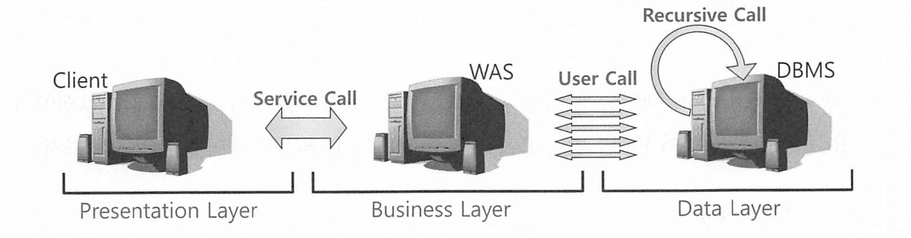
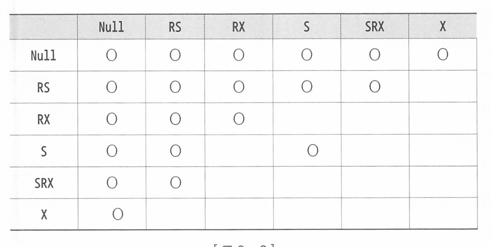
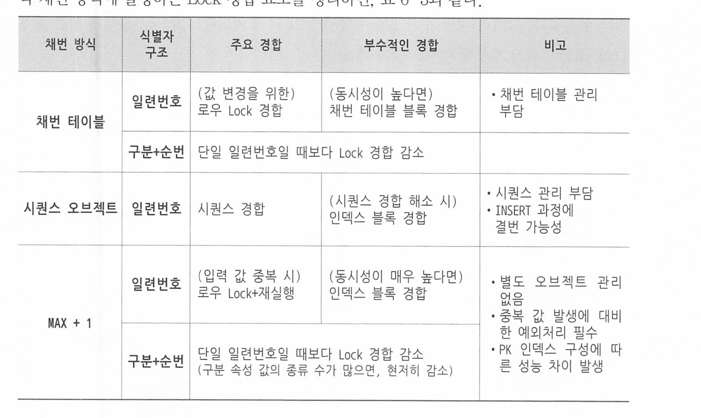

# 6장. DML 튜닝

## 6.1 기본 DML 튜닝

### 6.1.1 DML 성능에 영향을 미치는 요소

* 인덱스
* 제약조건
* 조건절
* 서브쿼리
* Redo, Undo 로깅
* Lock
* 커밋

#### 인덱스와 DML 성능

INSERT시 인덱스가 들어갈 블록을 찾아 넣어야 하므로 부하가 걸린다.

DELETE시 인덱스 레코드를 찾아서 삭제해줘야 한다

UPDATE 할 때는 변경된 컬럼을 참조하는 인덱스만 찾아 변경해주면 된다. 

테이블에서 한 건 변경할 때마다 인덱스에서는 2개의 오퍼레이션이 발생한다. 


즉 인덱스 개수가 DML성능에 영향을 매우 미치므로, 인덱스 하나라도 줄이면 TPS는 그만큼 향상된다

#### 무결성 제약조건과 DML 성능

* 참조, 도메인 무결성 - PK, FK, Check, NotNULL 
  * check는 age >= 10 같은 그냥 사용자 정의 무결성 제약조건임

PK, FK제약은 Check, Not null 제약조건보다 성능에 더 큰 영향을 미친다.

Check, NotNull은 정의한 제약 조건을 준수하는지만 확인하면 되지만, PK, FK 제약은 실제 데이터를 조회 해봐야 하기 때문이다.

#### Redo 로깅과 DML 성능

오라클은 파일에 가해지는 모든 변경사항을 Redo 로그에 기록한다. 

* Redo 로그는 트랜잭션데이터가 유실됐을 떄 트랜잭션을 재현함으로써 복구하는데 사용됌

INSERT 작업에 대해 Redo 로깅 생략 기능을 제공하며, 생략하면 성능은 빨라지지만 복구에는 사용할 수 없다.

#### Undo 로깅과 DML 성능

Redo는 과거를 현재상태로 복구하는데 사용하고, Undo는 트랜잭션을 롤백하는데 사용하여 현재를 과거 상태로 되돌리는데 사용된다.

DML을 수행할때마다 Undo를 생성하므로 성능에 영향을 미치지만, 이 Undo를 안남길수는 없고 방법도 제공하지 않는다

#### Lock과 DML 성능

Lock을 필요 이상으로 자주, 길게 사용하면 DML 성능은 당연히 느려진다.


또한 커밋도 성능에 영향을 미치는데, 프로세스가 했던 작업을 디스크에 기록하라는 명령어인 셈이므로, 저장 완료할때까지 다음 작업을 진행할 수 없다. Redo 로그에 기록된 내용을 디스크에 기록하도록 신호 보낸 후 작업을 완료했다는 신호를 받아야 진행할 수 있다. Sync(동기)방식인것이다. 그래서 커밋은 생각보다 느리고, 루프 돌면서 커밋하는것보다 모아서 커밋하는것이 좋다.

### 6.1.2 데이터베이스 Call과 성능 - 한방 SQL의 중요성

SQL은 아래 3단계로 나누어 실행됌

- Parse Call : SQL 파싱과 최적화를 수행하는 단계다. SQL과 실행계획을 라이브러 리 캐시에서 찾으면, 최적화 단계는 생략할 수 있다.
- Execute Call : 말 그대로 SQL을 실행하는 단계다. DMIL은 이 단계에서 모든 과정 이 끝나지만, SBLECT 문은 Fetch 단계를 거친다.
- Fetch Call : 데이터를 읽어서 사용자에게 결과집합을 전송하는 과정으로 SELECT
    문에서만 나타난다. 전송할 데이터가 많을 때는 Fetch Call이 여러 번 발생한다.



CALL이 어디서 발생하느냐에 따라 User Call과 Recusive Call로 나뉨


User Call : 네트워크를 통해 외부로부터 인입되는 CALL. WAS에서 발생하는 CALL이라고도 할수있다.

Recusive Call : DBMS 내부에서 발생하는 CALL. SQL 파싱과 최적화 과정에서 발생하는 데이터 조회, PL/SQL로 작성한 사용자 정의 함수, 프로시저, 트리거에 내장된 SQL 실행시 발생하는 CALL


즉 Call이 발생할때마다 Parse, Execute, Fetch가 발생하며 Call이 많으면 성능은 느릴수밖에 없으며, 네트워크를 경유할수록 당연히 지연시간이 붙어 더 느려진다.


예를들어 100만건 데이터를 insert하는데, 1건씩 넣는다고 하자.

당연히 네트워크를 경유하면서, 한건한건씩 커밋하니까 매우 느릴수밖에 없다. (커밋도 속도가 매우 느림)

이때 bulk로 해서 천개, 만개, 십만개씩이라도 묶어 처리하면 성능은 급격하게 상승된다

### 6.1.4 인덱스 및 제약 해제를 통한 대량 DML 튜닝

제약조건을 비활성화 하고, 인덱스도 Drop하고 대량의 데이터를 insert 하면 성능이 매우 빨라진다. 


수정가능 조인뷰와 Merge는 오라클 전용이라 생략. 

## 6.2 Direct Path I/O 활용

OLTP는 반복적으로 읽기 때문에 버퍼 캐시가 상당히 도움을 주지만 배치 프로그램등은 대량 데이터를 처리하기 때문에 버퍼 캐시를 경유하는 I/O가 성능을 떨어트릴 수 있다.

파일 캐시를 경유하지 않고 버퍼 풀에서 디스크로 직접 액세스해서 불필요한 지연(2중 캐시 처리)이 발생하지 않도록 하는 방식이 바로 Direct I/O이다.

메모리 효율적 사용: 복사 과정 감소
캐시 관리 단순화: 파일 시스템 캐시를 사용하지 않기 때문에 캐시 관리의 복잡성을 피할 수 있음

**MySQL**에서는 **InnoDB 스토리지 엔진**을 통해 **Direct I/O**를 지원한다. 아래 설정을 통해 지원할 수 있다. 

- **`innodb_flush_method` 설정**

  - **`O_DIRECT`**: 데이터 파일에 대한 I/O에서 OS의 버퍼 캐시를 우회하여 디스크에 직접 접근
  - **`O_DIRECT_NO_FSYNC`**: `O_DIRECT`와 유사하지만, 파일 동기화를 위한 `fsync()` 호출을 생략하여 성능을 더욱 향상시킨다.

- **설정 방법**

  ```
  SET GLOBAL innodb_flush_method = O_DIRECT;
  ```

  또는 `my.cnf` 설정 파일에 다음과 같이 추가

  ```
  [mysqld]
  innodb_flush_method = O_DIRECT
  ```

- **주의사항**

  - Direct I/O를 사용하면 OS의 버퍼 캐시를 우회하므로, 데이터베이스와 OS 간의 캐시 일관성이 향상되고 성능이 개선될 수 있다.
  - 그러나 디스크 및 파일 시스템의 특성에 따라 성능 이점이 달라질 수 있으므로, 테스트를 통해 확인하는 것이 좋다.


### 6.2.1 Direct Path I/O

오라클은 버퍼 캐시를 경유하지 않고 곧바로 데이터 블록을 읽고쓸수있는 Direct Path I/O 기능을 제공하며, 아래는 그 기능이 작동하는 경우다

1. 병렬 쿼리로 Full Scan을 수행할 때
2. 병렬 DML을 수행할 때
3. Direct Path Insert를 수행할 때
4. Temp 세그먼트 블록들을 읽고 쓸 때
5. direct 옵션을 지정하고 export를 수행할 때
6. nocache 옵션을 지정한 LOB 컬럼을 읽을 때

## 6.3 파티션을 활용한 DML 튜닝

### 6.3.1 테이블 파티션

파티셔닝은 테이블 또는 인덱스 데이터를 특정 컬럼(파티션 키)값에 따라 별도 세그먼트에 나눠서 저장하는 것을 말한다. 

파티셔닝을 이용하는 이유는 다음과 같다

- 관리적 측면 : 파티션 단위 백업, 추가, 삭제, 변경 - 가용성 향상
- 성능적 측면 : 파티션 단위 조회 및 DML, 경합 또는 부하 분산


파티션은 Range, 해시, 리스트 세종류가 있다.

#### Range 파티션

지정된 열의 값을 기준으로 연속적인 범위를 정의하여 데이터를 분할한다.

주로 날짜 컬럼을 기준으로 파티셔닝 한다. 

읽을때도 검색 조건을 만족하는 파티션만 골라 읽을 수 있어 이력성 데이터를 조회할때 성능을 크게 향상시킨다.

```sql
CREATE TABLE orders (
    order_id INT,
    order_date DATE,
    customer_id INT
)
PARTITION BY RANGE (YEAR(order_date)) (
    PARTITION p2020 VALUES LESS THAN (2021),
    PARTITION p2021 VALUES LESS THAN (2022),
    PARTITION p2022 VALUES LESS THAN (2023)
);
```


#### 해시 파티션

해시 파티션은 파티션 키 값을 해시 함수에 입력해서 반환받은 값이 같은 데이터를 같은 세그먼트에 저장하는 방식이다.

해시 파티션은 id처럼 변별력이 좋고 데이터 분포가 고른 컬럼을 기준으로 선정하는것이 효과적이다. 

```sql
CREATE TABLE sessions (
    session_id INT,
    user_id INT,
    login_time DATETIME
)
PARTITION BY HASH (user_id) PARTITIONS 4;
```

#### 리스트 파티션

사용자가 정의한 그룹핑 기준에 따라 데이터를 분할 저장하는 방식이다. 

각 파티션은 특정 값의 목록을 가진다.

```sql
CREATE TABLE users (
    user_id INT,
    country_code VARCHAR(2),
    name VARCHAR(100)
)
PARTITION BY LIST (country_code) (
    PARTITION pUS VALUES IN ('US'),
    PARTITION pCA VALUES IN ('CA'),
    PARTITION pUK VALUES IN ('UK'),
    PARTITION pOthers VALUES IN ('AU', 'NZ')
);

```

### 6.3.2 인덱스 파티션

인덱스 파티션은 테이블 파티션과 맞물려 다양한 구성이 존재한다. 다양한 인덱스 파티션 구성을 설명하기 위해 우선 테이블 파티션을 다음과 같이 구분하자.

- 비파티션 테이블(Non-Partitioned Table)
- 파티션 테이블(Partitioned Table)

인덱스도 테이블처럼 파티션 여부에 따라 파티션 인덱스와 비파티션 인덱스로 나뉘고, 파티 션 인덱스는 각 파티션이 커버하는 테이블 파티션 범위에 따라 로컬과 글로벌로 나뉜다.

- 로컬 파티션 인덱스(Local Partitioned Index)
- 글로벌 파티션 인덱스(Global Partitioned Index)
- 비파티션 인덱스(Non-Partitioned Index)


로컬 파티션 인덱스는 각 테이블 파티션과 인덱스 파티션이 1:1 대응관계가 되도록 오라클이 자동으로 관리하는 파티션 인덱스다. 

옷을 계절별로 나누었다면 (테이블 파티션) 옷이 어디들어있는지 별도 색인을 만든것이 로컬 파티션 인덱스다. 

로컬 파티션 인덱스의 장점은 관리 편의성에 있다. 피크 시간대만 피하면 서비스를 중단하지 않고도 작업할 수 있다.


글로벌 파티션 인덱스는 파티션을 테이블과 다르게 구성한 인덱스다.

파티션 유형이 다르거나, 키가 다르거나, 기준값 정의가 다른경우다. 

로컬 파티션 인덱스와는 다르게, 해당 테이블을 사용하는 서비스를 중단해야 한다. 


비파티션 인덱스는 파티셔닝 하지 않은 인덱스다. 

글로벌 비 파티션 인덱스라고도 부르며, 테이블 파티션 구성을 변경하는순간 인덱스를 바로 재생성 해줘야 하며 그동안 서비스를 중단해야 한다. 


### 6.3.3 파티션을 활용한 대량 UPDATE 튜닝

인덱스가 DML 성능에 영향을 미치도록 대량 입력 / 수정 /삭제 할 경우 인덱스를 Drop하거나 Unuable 상태로 변경하고서 작업을 많이한다.

수정하는 데이터 비중이 5%정도를 넘는다면 인덱스 없이 작업한 후에 재생성하는게 더 빠르다. 


#### 파티션 exchange를 이용한 대량 데이터 변경 

초 대량 데이터 테이블을 수정해야 할때는 수정된 값을 갖는 임시 테이블을 만들고 원본 파티션과 바꿔치기하는것이 좋다.

1. 임시테이블 생성
2. 임시 테이블에 데이터 입력 및 수정
3. 임시 테이블에 인덱스 생성
4. 파티션과 임시 테이블을 exchange(바꿔치기)
5. 임시테이블 drop


### 6.3.4 파티션을 활용한 대량 DELETE 튜닝

파티셔닝이 삭제 조건절과 같은 기준이고, 인덱스도 로컬 파티션이면 특정 파티션을 drop 시키는걸로 한번에 처리할 수 있다.

## 6.4 Lock과 트랜잭션 동시성 제어

### 6.4.1 오라클 Lock

Dml Lock은 다중 트랜잭션이 동시에 액세스하는 데이터의 무결성을 보호해준다.

DML Lock에는 테이블 Lock과 Row Lock이 있다. 


오라클도 MySQL과 비슷하다. Mvcc 모델을 사용하면 lock을 사용하지 않은 select문으로 트랜잭션이 진행중인 데이터를 읽으면 undo log인 복사본을 읽어 데이터를 반환한다.


### DML 테이블 Lock



* Lock 모드간 호환성 정리 표.
* RS : row share 
* RX: row exclusive
* S : share
* SRX share row exclusive
* X: exclusive  

위 표를 보고, 선행 트랜잭션이 건 락과 호환되지 않는 모드로 테이블 Lock을 설정하려는 후행 트랜잭션은 무조건 대기해야 한다.

RS, RX 간에는 어떤 조합으로도 호환이 되므로 테이블 Lock에 의한 경합은 발생하지 않으며 로우를 갱신하려고 할때만 경합이 발생한다.


SELECT FROM UPDATE WAIT 3는 3초간 락을 사용하겠단 뜻이다. 

SELECT FOR UPDATE NOWAIT는 잠금을 대기하지 않고 즉시 시도하는 옵션이며, 잠겨있으면 즉시 에러를 반환한다. 잠금 대기로 인한 지연을 피하고자 할때 사용한다 

### 6.4.2 트랜잭션 동시성 제어

비관적, 낙관적 동시성 제어로 나뉜다.


#### 비관적 동시성 제어

예를들어, 고객의 실적정보를 읽고 적립 포인트를 계산해야 한다면

SELECT문에 FOR UPDATE 때려박아서 잘못 갱신되는 문제를 방지할 수 있다.

WAIT 또는 NOWALT 옵션을 사용하면, 다른 트랜잭션에 의해 Lock이 걸렸을 때 Exception 을 만나게 되므로 "다른 사용자에 의해 변경 중이므로 다시 시도하십시오"라는 메시지를 출 력하면서 트랜잭션을 종료할 수 있다. 따라서 오히려 동시성을 증가시키게 된다.


### 6.4.3 채번 방식에 따른 INSERT 성능 비교

DML 중 INSERT가 제일 중요하다.

수행빈도가 높기도 하지만 채번 방식에 따른 성능 차이가 매우 크다.

아래 세가지 채번 방식의 성능과 장단점을 비교해보자

- 채번 테이블
- 시퀀스 오브젝트
- MAX + 1 조회


#### 채번 테이블

각 테이블 식별자의 단일컬럼 또는 구분 속성별 순번을 채번하기 위해 별도 테이블을 관리하기 위한 방식.

채번 레코드를 읽어 1을 더한값으로 변경한다.

채번 레코드를 변경하는 과정에 자연스럽게 직렬화(트랜잭션)가 이루어 져서 중복 값을 채번할 가능성을 방지한다

장점

* 범용성이 좋음
* 중복 레코드 발생에 대비한 예외 처리 신경 안써도 됌. (MAX + 1방식과 비교)
* INSERT 과정에 결번 방지 (시퀀스 방식과 비교대상)
* PK가 복합컬럼일떄도 사용 가능 

단점

* 시퀀스나 MAX + 1보다 성능이 안좋다. 로우간 경합 때문이다. 

#### 시퀀스 오브젝트

sequence의 가장 큰 장점은 성능이 빠르다.

시퀀스는 **값을 메모리에 캐시**하여 디스크 I/O를 최소화하고, 성능을 향상시킨다. 

시퀀스는 **캐시 크기(cache size)**를 설정하여, 미리 여러 개의 시퀀스 값을 메모리에 로드하고 미리 돌려준다.

시퀀스 캐시에서 값을 얻을때도 내부적으로 SQ Lock이라고 해서 시퀀스 캐시 락을 사용한다. 


시퀀스의 단점은 PK가 단일 컬럼일때만 사용 가능하며, 결번이 생길수가 있다. 

* 시퀀스 채번 이후 롤백되거나
* 시퀀스가 캐시에서 밀리거나, 인스턴스 재기동 등 

### MAX + 1

마지막 일련번호 조회하고 1을 더해서 INSERT 하는방식

장점

* 별도 테이블 X 서능 매우 빠름 

단점

* 레코드 중복에 대비한 예외 처리가 필요함
* 다중 트랜잭션에 의한 동시 채번시 롤백때문에 성능이 훨씬 나빠짐 



#### 인덱스 블록 경합

INSERT 성능이 너무 빨라도 인덱스 경합때문에 성능이 나빠진다.

채번을 생략하거나, MAX + 1을 사용하면 자주 나타난다 (채번테이블이나 시퀀스는 락때문에 직렬화 되어서 좀 들하다 )

일련번호나 입력일시 처럼 순차적으로 값이 증가하는  Right-growing index인덱스에서 주로 인덱스 경합이 발생한다.  인덱스에서 **새로운 데이터가 항상 인덱스의 오른쪽 끝에 추가되는 형태의 인덱스**이다. 

* 시퀀스, 시간 등

오른쪽으로만 인덱스 오른쪽에 삽입되므로 해당 위치에 대한 경합이 발생하며, 트랜잭셩 성능을 떨어트린다. 

해결방법

1. **인덱스 키의 랜덤화**:
   - **해시 함수 사용**: 인덱스 키에 해시 함수를 적용하여 데이터 삽입 위치를 분산시킨다.
   - **UUID 사용**: 고유 식별자(UUID)를 사용하여 데이터가 인덱스 전반에 걸쳐 분산되도록 한다.
   - **역순 저장**: 키 값을 역순으로 저장하여 분포를 분산시킨다.
2. **파티셔닝(Partitioning)**:
   - 데이터베이스 테이블을 여러 파티션으로 분할하여, 특정 파티션에 대한 경합을 줄인다.
3. **클러스터링 인덱스 조정**:
   - 클러스터링 인덱스의 키를 변경하거나 조정하여 데이터 분포를 개선한다.
4. **데이터베이스 설정 최적화**:
   - **Fill Factor 조정**: 인덱스 페이지의 채우기 비율을 낮춰 페이지 분할 빈도를 줄인다.
   - **버퍼 풀 크기 조정**: 캐시 메모리 크기를 늘려 인덱스의 핫 스팟을 메모리에 유지한다.